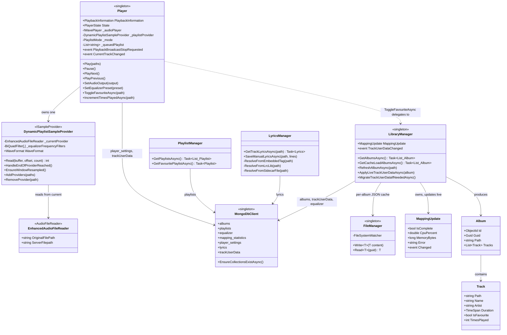

# Class diagram — MusicPlayer core domain

_Category: [Architecture diagrams](../../DOCUMENTATION_CHECKLIST.md) · Last verified against code: 2026-09-26_

## Why this doc exists

Every other doc in this repo explains one feature at a time. This one steps back and shows how the handful of
long-lived singletons in `MusicPlayer` actually relate to each other — what owns what, and which class is
responsible for which slice of state. It's a map to orient with before diving into any single feature doc.

## Core domain classes

## Reading this diagram

- **`Player`** and **`LibraryManager`** are the two big singletons — `Player` owns everything about the *current
  playback session* (queue, output device, live position), `LibraryManager` owns everything about *what's in the
  library* (mapping, favourites/play-counts, the JSON display cache). See [Storage map](../07-persistence-storage/storage-map.md)
  for exactly which of their fields live where.
- **`DynamicPlaylistSampleProvider`** is the only class that actually touches raw audio samples — see
  [Audio pipeline architecture](../01-playback-engine/audio-pipeline.md) for how it achieves gapless playback.
- **`MongoDbClient`** and **`FileManager`** are the two persistence gateways every domain class goes through;
  neither `Player` nor `LibraryManager` talks to Mongo or the filesystem through any other path.
- Neither `Player` nor `LibraryManager` references anything in `MusicServer` — the events on `Player`
  (`PlaybackBroadcastStopRequested`, `CurrentTrackChanged`) and `LibraryManager` (`TrackUserDataChanged`) are how
  state changes reach SignalR without a circular project reference — see
  [Event-bridge pattern](../05-realtime-sync/event-bridge-pattern.md).
- This diagram omits DTOs, hub classes, and `MusicServer`'s own broadcast-loop classes entirely — it's scoped to
  `MusicPlayer`'s core domain only. See [System architecture overview](system-architecture.md) for where
  `MusicServer` and the frontend fit around this core.
