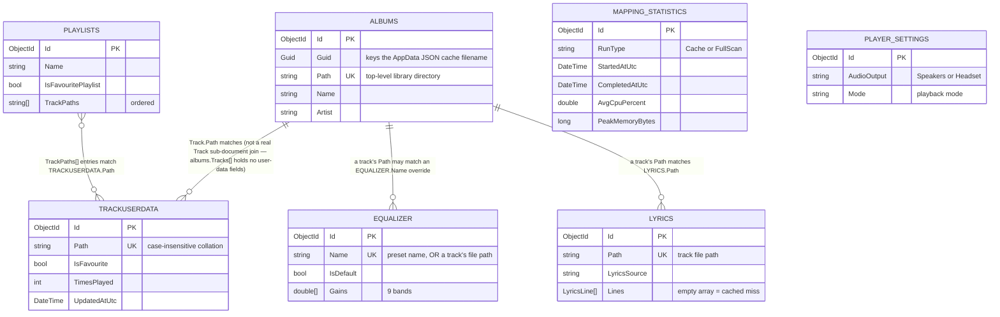

# ERD — MongoDB collections

_Category: [Architecture diagrams](../../DOCUMENTATION_CHECKLIST.md) · Last verified against code: 2026-09-26_

## Why this doc exists

MongoDB is schemaless, so there's no database-enforced relationship between these seven collections — everything
below is a *convention*, tied together by matching on `Path`/`Name` string fields rather than foreign keys. This
doc makes those implicit relationships explicit. See [Storage map](../07-persistence-storage/storage-map.md) for
the full narrative behind each collection, including the bugs that motivated some of these designs.

## Collections and their relationships

## Reading this diagram

- **There is no real foreign key anywhere in this schema.** Every relationship drawn above is a
  string-equality match on a file path (or, for `equalizer`, sometimes a preset name instead of a path) —
  MongoDB never enforces any of it, and a stale/renamed path silently breaks the join with no error. This is
  the exact shape that caused `KNOWN_ISSUES.md` items #18/#25/#29 before `trackUserData` consolidation and the
  cache-identity fix.
- **`albums` does not contain track display metadata at all** — `Track.Name`/`Artist`/`Duration`/`Image` are
  `[BsonIgnore]`. The only place a track's actual display metadata lives is the per-album AppData JSON file,
  which isn't a Mongo collection and so doesn't appear in this ERD — see
  [Display metadata split](../02-library-mapping/display-metadata-split.md).
- **`equalizer` is one collection serving two purposes** — named presets (`IsDefault = true`-ish, keyed by a
  human name like "Hip Hop") and per-track overrides (keyed by the track's own file path, `IsDefault = false`)
  live side by side, distinguished only by what happens to be in `Name`.
- **`trackUserData` is the single source of truth for favourites/play-counts** — nothing else in this schema
  duplicates that state anymore (see [Track user data](../02-library-mapping/track-user-data.md)); the
  relationships to `albums` and `playlists` shown here are read-time overlays, not stored duplication.
- Redis (`SelectedAlbum`, `scrollProsition`) and the AppData JSON files aren't part of this ERD since they're not
  MongoDB collections — see [Storage map](../07-persistence-storage/storage-map.md) for those.
