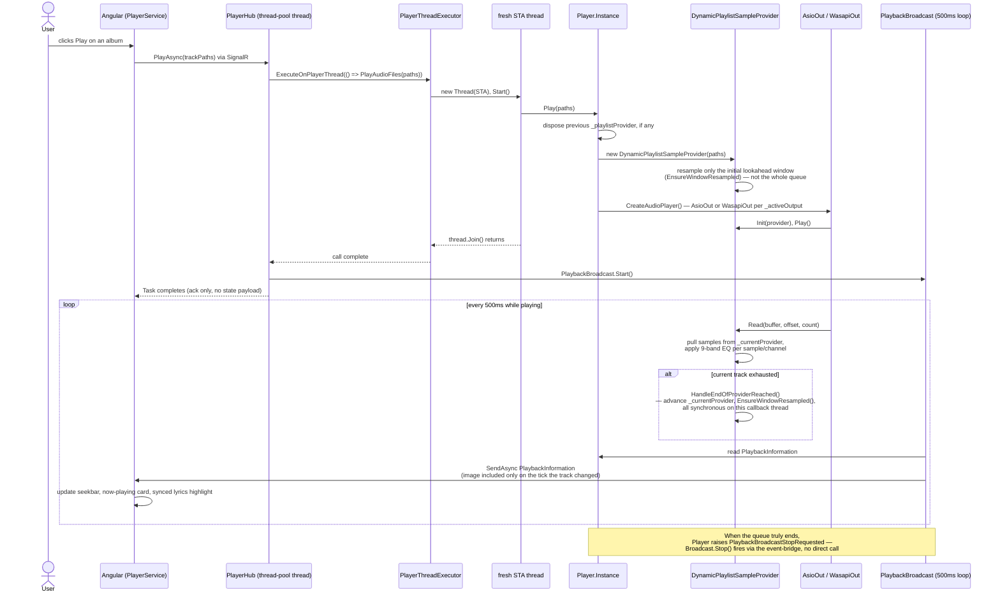

# Flow diagram — end-to-end playback request

_Category: [Architecture diagrams](../../DOCUMENTATION_CHECKLIST.md) · Last verified against code: 2026-09-26_

## Why this doc exists

A single "click Play" action touches almost every architectural pattern documented elsewhere in this repo — STA
thread marshaling, the event-bridge, the broadcast-loop pattern, and the gapless audio pipeline. This doc traces
one request start to finish so those pieces can be seen working together, rather than only in isolation. See
[Transport controls](../01-playback-engine/transport-controls.md), [Audio pipeline](../01-playback-engine/audio-pipeline.md),
and [Broadcast loop pattern](../05-realtime-sync/broadcast-loop-pattern.md) for the detail behind each stage.

## Sequence: user clicks Play on an album

## Key architectural points this trace illustrates

- **The STA hop is mandatory, not incidental** — `AsioOut`/`WasapiOut` are COM-based and the hub method itself
  runs on an arbitrary thread-pool thread, so every actual playback mutation is marshaled onto a dedicated,
  throwaway STA thread via `PlayerThreadExecutor`. See [Transport controls](../01-playback-engine/transport-controls.md).
- **Only the lookahead window is resampled up front** — `Play()` doesn't block on resampling the entire queue;
  gapless playback is maintained by keeping the current + next few tracks ready and resampling further ahead as
  playback advances. See [Lazy resample window](../01-playback-engine/lazy-resample-window.md).
- **The hub call's own response carries no state** — the frontend doesn't learn "what's playing now" from
  `PlayAsync`'s return value; it learns it from the next `PlaybackBroadcast` tick, decoupling the request/ack
  from the actual state push.
- **`HandleEndOfProviderReached` runs synchronously on the audio callback thread** — nothing about advancing to
  the next track is deferred, which is exactly what makes the track transition gapless (no round trip off the
  callback thread to decide what's next).
- **The broadcast loop, not the hub call, is what the UI actually watches** — this is the same
  `PeriodicTimer`-plus-edge-triggering shape used by every other `*Broadcast.cs` class; see
  [Broadcast loop pattern](../05-realtime-sync/broadcast-loop-pattern.md) for the shared skeleton and why it
  replaced the old unconditional-broadcast design.
- **Stopping is event-driven, not hub-driven** — `Player` has no idea `PlaybackBroadcast` exists; it just raises
  `PlaybackBroadcastStopRequested` when the queue ends, and `PlaybackBroadcast.Initialize` (subscribed once at
  startup) reacts by calling its own `Stop()`. See [Event-bridge pattern](../05-realtime-sync/event-bridge-pattern.md).
