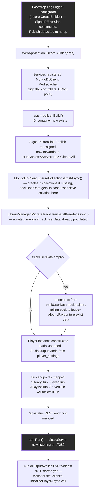

# Flow diagram — MusicServer startup sequence

_Category: [Architecture diagrams](../../DOCUMENTATION_CHECKLIST.md) · Last verified against code: 2026-09-26_

## Why this doc exists

Startup ordering matters more than it looks like it should here: the Serilog sink has to exist before
`CreateBuilder` runs, the trackUserData migration has to finish before any client can read the collection, and
`SignalRErrorSink.Publish` can't be wired to a real hub context until the DI container exists. This doc traces
that ordering end to end, pulling together details that otherwise live scattered across
[SignalRErrorSink](../05-realtime-sync/signalr-error-sink.md), [Track user data](../02-library-mapping/track-user-data.md),
and [Player settings persistence](../01-playback-engine/player-settings-persistence.md).

## Sequence

## What's deliberately deferred past this point

Not everything spins up at process start — several things wait for the first client connection:

- **`AudioOutputAvailabilityBroadcast`** only starts once a client calls `PlayerHub.InitializePlayerAsync` — see
  [Transport controls](../01-playback-engine/transport-controls.md).
- **`PlaybackBroadcast`** only starts on the first `PlayAsync` call — there's no "resume playing on startup"
  behavior; `Player.Instance`'s queue and position are always empty immediately after a restart (only
  `AudioOutput`/`Mode` persist — see [Storage map](../07-persistence-storage/storage-map.md)'s in-memory-only
  section).
- **`PlaylistBroadcast`/`ServerStatusBroadcast`** start/stop per-hub-connection, driven by explicit
  `Start*Async`/`Stop*Async` calls the frontend makes on connect/disconnect.
- **`MappingUpdateBroadcast`/`TrackUserDataBroadcast`** subscribe to their events once, at startup (step `d`
  onward, alongside the other DI-registered singletons) — but they have nothing to forward until a mapping run
  or a favourite/play-count write actually happens.

## Known constraints

- Any log event emitted before step `e` (the `Publish` reassignment) is captured in the rolling file log but
  never reaches a client — by design, since nothing can be connected that early. A startup crash purely visible
  as "client saw nothing" needs the file log, not the SignalR toast stream, to diagnose.
- `EnsureCollectionsExistAsync` sets `trackUserData`'s collation at creation time only — if that collection
  already exists from before this feature shipped, its collation won't retroactively change; only a fresh
  database (or an explicit drop-and-recreate) gets the case-insensitive behavior automatically.
