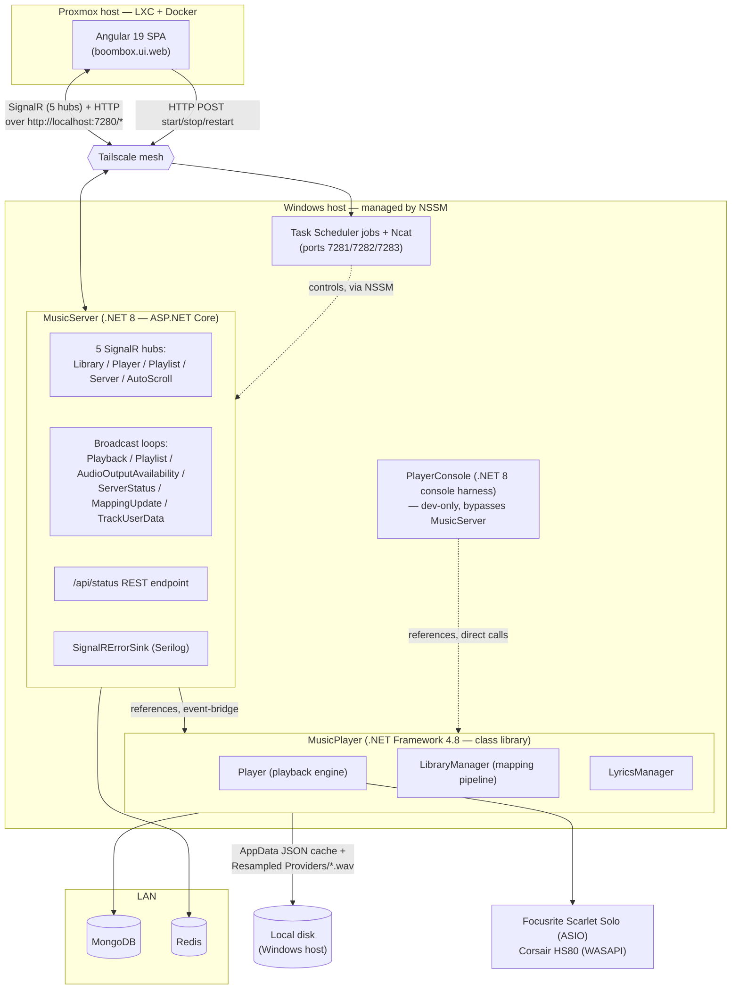

# System architecture overview

_Category: [Architecture diagrams](../../DOCUMENTATION_CHECKLIST.md) · Last verified against code: 2026-09-26_

## Why this doc exists

This ties together the pieces every other doc discusses individually — the three .NET projects, the Angular UI,
the storage tiers, and the physical/network topology they run on — into one picture. See
[Full deployment topology](../08-deployment/deployment-topology.md) and [SignalR hub topology](../05-realtime-sync/hub-topology.md)
for the detail behind each box here.

## Component and container view

## Layer summary

- **Frontend** — one Angular SPA, five persistent SignalR connections, no REST layer for application data. Runs
  in Docker inside an LXC container on a separate Proxmox host from the backend. See
  [Frontend UI shell](../06-frontend-ui-shell/) and the [UI repo's own README](../../../boombox.ui.web/boombox/README.md).
- **`MusicServer`** — the only network-facing .NET process. Owns SignalR hubs, background broadcast loops, the
  small `/api/status` endpoint, and the Serilog-based `SignalRErrorSink` that turns any Warning+ log line into a
  client toast. References `MusicPlayer` but never the reverse — see
  [Event-bridge pattern](../05-realtime-sync/event-bridge-pattern.md) for why.
- **`MusicPlayer`** — the actual playback/library/lyrics engine, framework-locked to .NET Framework 4.8 because
  `AsioOut`/`WasapiOut` are COM-based. Has no knowledge that SignalR, `MusicServer`, or even a network exists.
- **`PlayerConsole`** — a standalone dev harness referencing `MusicPlayer` directly, entirely outside the
  `MusicServer`/SignalR path; useful for exercising the playback engine without standing up the full host.
- **Storage** — MongoDB and Redis on the LAN, reached directly by the Windows host (not through Tailscale); a
  local AppData JSON cache and a `Resampled Providers` `.wav` cache live on the Windows host's own disk. See
  [Storage map](../07-persistence-storage/storage-map.md) for the full breakdown of what lives where and why.
- **Remote control** — three Task Scheduler jobs, each fronted by Ncat on its own port, let the frontend
  start/stop/restart the `MusicServer` Windows service without any of that logic living inside the app itself.
  See [Remote start/stop/restart mechanism](../08-deployment/remote-control-mechanism.md).
- **Hardware** — `Player` talks directly to a Focusrite Scarlet Solo over ASIO or a Corsair HS80 over WASAPI;
  which one is active is a runtime choice, not a build-time one. See
  [Audio output switching](../01-playback-engine/audio-output-switching.md).

## Known constraints

- None of this topology (NSSM, Task Scheduler, Proxmox/Docker/LXC, Tailscale) is captured as code in either
  repo — see [Full deployment topology](../08-deployment/deployment-topology.md) for the full caveat.
- The Angular app addresses `MusicServer` as `http://localhost:7280` even though it's running on an entirely
  separate physical host — this only works because Tailscale makes that address resolve correctly from the
  container's network namespace.
