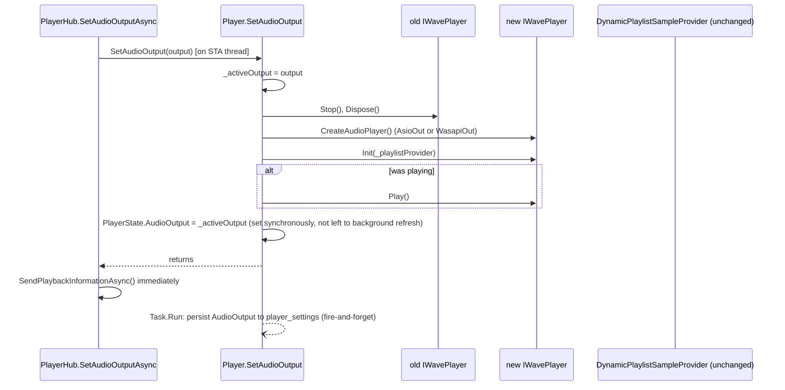
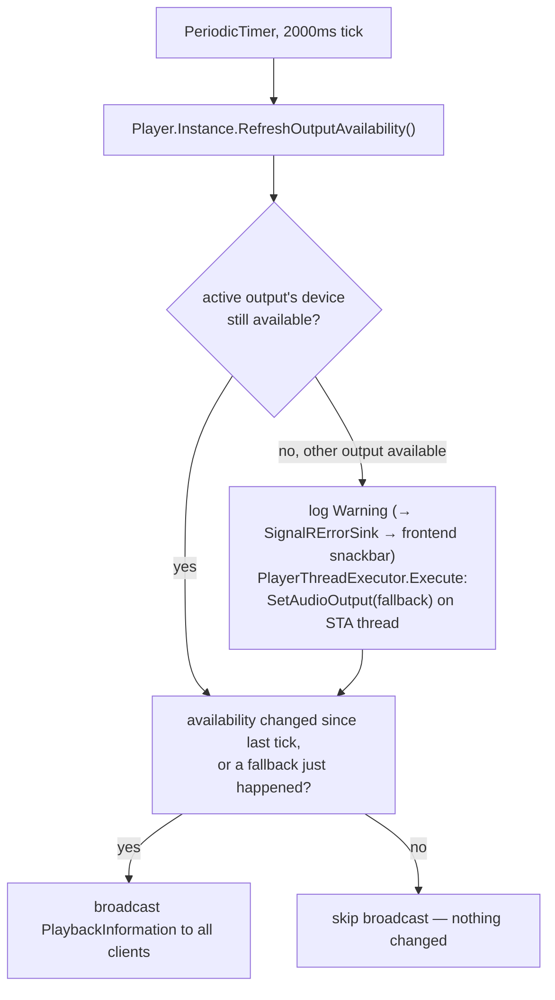

# Audio output switching

_Category: [Playback engine](../../DOCUMENTATION_CHECKLIST.md) · Last verified against code: 2026-09-25_

## What it does

Boombox plays through one of two outputs — Speakers (Focusrite Scarlet Solo, via ASIO) or Headset (Corsair
HS80, via WASAPI) — switchable manually, and automatically monitored so a device that disappears (USB unplug)
triggers a forced fallback to whichever output is still available.

## Manual switch: `Player.SetAudioOutput`

Called via `PlayerHub.SetAudioOutputAsync`, marshaled onto a dedicated STA thread like every other action that
touches the live pipeline (see [Transport controls](transport-controls.md)). Unlike `Play()`, it deliberately
does **not** rebuild `DynamicPlaylistSampleProvider` — NAudio sample providers track their own read position
internally, so switching output mid-track only needs a new `IWavePlayer` (`AsioOut` or `WasapiOut`) wrapped
around the *same* provider instance:

`CreateAudioPlayer()` picks the concrete type: Speakers always goes through the same ASIO driver `Play()` uses
(`new AsioOut(_activeDriver)`); Headset looks for an active WASAPI render endpoint whose name contains
`"HS80"` (`FindHeadsetDevice()`) and uses `new WasapiOut(headsetDevice, AudioClientShareMode.Shared, true,
200)` — if no matching device is found, it logs a warning and falls back to Speakers rather than throwing.

`PlayerState.AudioOutput` is set synchronously inside the lock, not left to the next background
`UpdatePlaybackInformation` pass — `PlayerHub.SetAudioOutputAsync` broadcasts `PlaybackInformation` immediately
after `SetAudioOutput` returns (same "broadcast now, don't wait for the 500ms tick" pattern used for
reorder/remove — see [Transport controls](transport-controls.md)), so the field needs to already be correct by
then.

## Automatic monitoring: `AudioOutputAvailabilityBroadcast`

An always-on background loop (`MusicServer/Startup/AudioOutputAvailabilityBroadcast.cs`), started once from
`PlayerHub.InitializePlayerAsync` and running for the life of the connection — independent of playback state,
because a USB device can disappear whether or not anything is playing (unlike `PlaybackBroadcast`'s 500ms loop,
which only runs while actively playing).

`RefreshOutputAvailability()` polls both devices every tick — `IsSpeakersDeviceAvailable()` via
`AsioOut.GetDriverNames()` (a registry lookup, never opens the driver, safe to poll during live ASIO playback)
and `IsHeadsetDeviceAvailable()` via the same WASAPI endpoint enumeration `FindHeadsetDevice()` uses — updates
`PlayerState.IsSpeakersAvailable`/`IsHeadsetAvailable` (so the frontend can grey out whichever output isn't
reachable), and returns a `RequiredFallback` only when the output *currently in use* just became unavailable
while the other one is still reachable. It deliberately does not perform the switch itself: it runs on an
arbitrary background thread, and `SetAudioOutput` needs the STA guarantee — so the loop calls
`PlayerThreadExecutor.Execute(() => Player.Instance.SetAudioOutput(requiredFallback.Value), ...)` directly (no
SignalR hub instance available from a background loop, hence going through the shared executor rather than
`PlayerHub`'s wrapper).

Broadcasts are edge-triggered, not sent every tick: `hasBroadcastOnce`/`lastSpeakersAvailable`/
`lastHeadsetAvailable` are tracked across ticks, and a `ReceivePlaybackInformation` message only goes out when
availability actually changed (or a fallback just happened) — the same "don't hammer clients with identical
updates" pattern used elsewhere (`KNOWN_ISSUES.md` #2). The 2000ms interval matches `PlaylistBroadcast`'s
polling rate — frequent enough that an unplug/replug feels near-immediate, without polling device enumeration
faster than a human plugging in a cable would ever notice.

A forced fallback is logged at `LogWarning`, not `LogInformation`, specifically because `Program.cs` wires
`SignalRErrorSink` to forward Warning-and-above log entries to clients as a snackbar — this is the whole
notification mechanism for "your output just changed without you asking," no separate hub call needed.

## Known constraints

- If *both* outputs become unavailable simultaneously, `RequiredFallback` stays `null` (no fallback target to
  switch to) — availability flags still update and broadcast, but playback keeps trying to use the now-missing
  active device until one becomes available again or the user switches manually.
- `SetAudioOutput` is a no-op if `_activeOutput == output` already — a fallback re-triggering with the same
  target on a later tick (e.g. availability flapping) doesn't tear down and recreate the `IWavePlayer`
  needlessly.
- Persisting the new output to `player_settings` (MongoDB) is fire-and-forget (`Task.Run`, no await) — see
  [Player settings persistence](player-settings-persistence.md).
