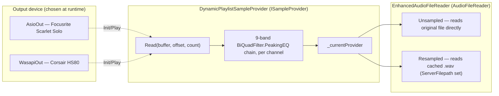
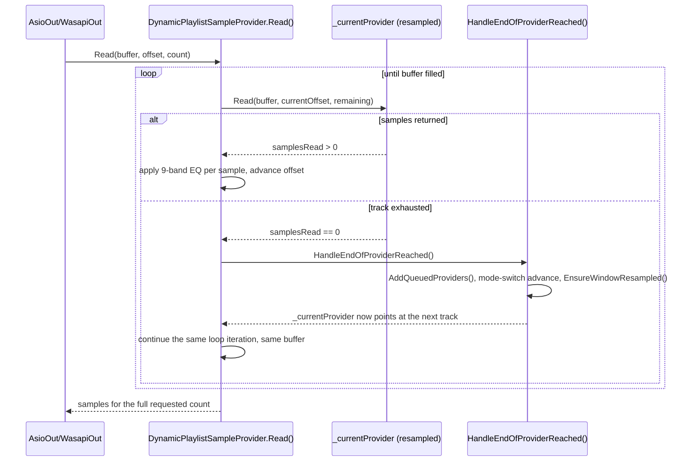

# Audio pipeline architecture

_Category: [Playback engine](../../DOCUMENTATION_CHECKLIST.md) · Last verified against code: 2026-09-25_

## What it does

Boombox plays audio through NAudio, output to either the Focusrite Scarlet Solo (ASIO) or a Corsair HS80
headset (WASAPI), with a custom sample provider (`DynamicPlaylistSampleProvider`) sitting in between the
output device and the actual audio files so the whole now-playing queue can be treated as one continuous
stream — no gap, glitch, or restart when one track ends and the next begins.

## The provider chain

- **`Player`** (singleton) owns exactly one `IWavePlayer` (`AsioOut` or `WasapiOut`) and exactly one
  `DynamicPlaylistSampleProvider`, created fresh on every `Play()` call. `CreateAudioPlayer()` picks the
  concrete output type from `_activeOutput`; switching output mid-track (`SetAudioOutput`) swaps the
  `IWavePlayer` underneath the *same* provider instance rather than rebuilding it, so NAudio's own internal
  read position isn't lost — switching Speakers↔Headset resumes from exactly where it was, no restart.
- **`DynamicPlaylistSampleProvider`** is the one custom piece: an `ISampleProvider` implementing `Read()` to
  pull samples from whichever track is "current," and — the part that makes gapless playback work — when the
  current track's `Read()` returns 0 samples (exhausted), it advances to the next track and keeps filling the
  *same* buffer in the *same* `Read()` call, rather than returning early. The audio callback never sees a gap.
- **`EnhancedAudioFileReader`** wraps NAudio's own `AudioFileReader` with two extra fields: `OriginalFilePath`
  (always set) and `ServerFilepath` (set only once the track has actually been resampled to the cache — see
  the [lazy resample window](lazy-resample-window.md)). A track with `ServerFilepath == null` is "unsampled":
  it opens the *original* source file directly, which is cheap and valid for reading `TotalTime`/duration for
  display, but is **never used for actual playback `Read()`** — only a resampled entry is. This is what lets
  the queue hold every track (for display/duration purposes) without resampling all of them up front.

## Why every track gets resampled before it's actually played

Source files come in at whatever sample rate/bit depth/channel count the original file has (mixed FLAC/MP3
library, mono and stereo, 44.1–192kHz). `DynamicPlaylistSampleProvider.WaveFormat` is fixed — `SAMPLE_RATE`
constant, 2 channels, 32-bit float — because the ASIO/WASAPI output and the 9-band EQ filter chain both need a
single consistent format to run against, not a different one per track. `WriteResampledFile` resamples each
track once, on first need, through NAudio's `WdlResamplingSampleProvider` (rate) and, for mono sources,
`MonoToStereoSampleProvider` (channel count) — see `KNOWN_ISSUES.md` #22 for the bug this fixed (reading a mono
source through a pipeline shaped for stereo packs two mono samples into one stereo frame, halving the
perceived timeline — "2x speed"). The result is cached as a `.wav` under `Resampled Providers/` (see the
[storage map](../07-persistence-storage/storage-map.md)) so it's only ever computed once per track per
session, not on every play.

## Gapless track-swap on `Read()`

The EQ filters are applied per-sample, per-channel, inline inside `Read()` — `_equalizerFrequencyFilters[band,
channel].Transform(...)`, one `BiQuadFilter.PeakingEQ` instance per band per channel (9 bands × 2 channels).
See [Equalizer](equalizer.md) for how gains get set without restarting playback.

## Known constraints

- **Everything in `HandleEndOfProviderReached()` runs synchronously, on the ASIO audio callback thread.**
  Gapless playback depends on `_currentProvider` already being updated before `Read()`'s loop continues within
  the same call — none of this can be deferred to a background thread. This is why queue mutations (add,
  remove, reorder) use a deferred-mutation pattern instead of touching the live queue directly — see
  [Now-playing queue management](queue-management.md).
- **ASIO/WASAPI are COM-based** and expect calls from a dedicated STA thread — see
  [Transport controls](transport-controls.md) for how `MusicServer` marshals hub-triggered actions onto one.
- **A defensive try/catch wraps the whole `HandleEndOfProviderReached` body** — an unhandled exception here
  used to propagate straight into NAudio's callback (a hard crash); now it logs and sets `_currentProvider =
  null`, which `Read()` already treats as "nothing left to play" and returns 0 samples cleanly.
