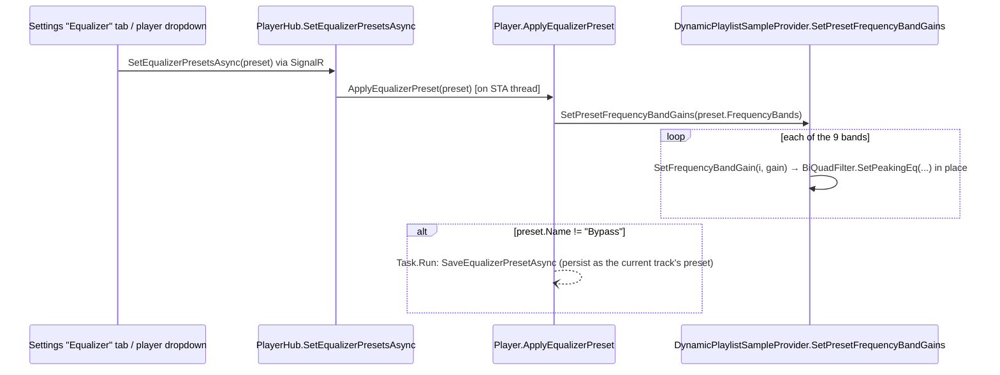

# Equalizer

_Category: [Playback engine](../../DOCUMENTATION_CHECKLIST.md) · Last verified against code: 2026-09-25_

## What it does

A 9-band parametric equalizer applied live, per sample, per channel, to whatever's currently playing — presets
can be swapped instantly (no restart, no gap) and individual band gains can be dragged in real time.

## Bands, filters, and where gains live

`DynamicPlaylistSampleProvider` holds `_equalizerFrequencyFilters` — a `BiQuadFilter[9, channels]` grid, one
`BiQuadFilter.PeakingEQ` instance per band per channel (9 bands × 2 channels = 18 filters) — plus
`_activeFrequencyBandGains` (`float[9]`), the currently-applied gain for each band. `CreateEqualizerFrequencyFilters()`
builds the whole grid once, in the constructor, from `_bandCenterFrequencies` (see below) and whatever gains the
first track's preset supplies.

**Center frequencies are fixed and shared across every preset.** `Player.PrepareEqualizerPresets()` derives
`_bandCenterFrequencies` once, at startup, from the "Flat" preset's `FrequencyBands` ordered by `Frequency` —
every other preset (and every per-track custom preset) is assumed to supply gains for those same 9 frequencies,
in the same order. Only gain varies per preset; the frequencies themselves are never per-preset data.
`BAND_WIDTH_Q` (`1.414`, i.e. one octave) is likewise a single shared constant, not configurable per band.

## Applying a preset

`SetPresetFrequencyBandGains` orders the incoming bands by frequency (so caller order doesn't matter), validates
every gain is within ±15dB (throws `InvalidDataException` otherwise, caught and logged — not surfaced to the
user beyond that), then calls `SetFrequencyBandGain` once per band. Each call mutates the existing `BiQuadFilter`
instance in place via NAudio's `SetPeakingEq(...)` — filters are never rebuilt or replaced, so there's no
allocation or gap in `Read()`'s per-sample loop (see [Audio pipeline § Gapless track-swap on
Read()](audio-pipeline.md#gapless-track-swap-on-read)) while a preset changes mid-playback.

`"Bypass"` is a special preset name: applying it sets all gains without triggering the save-as-current-track's-
preset side effect below — it's a transient "hear it flat" toggle, not something meant to be remembered as the
track's chosen preset.

## Persistence: saved per-track, not globally

Applying any preset other than `"Bypass"` fires `SaveEqualizerPresetAsync` (fire-and-forget `Task.Run`), which
associates the applied bands with the **currently playing track specifically**, not with the session or the
queue as a whole:

- if the current track already has its own saved preset (a Mongo document whose `Name` is the track's path),
  its `FrequencyBands` are updated in place;
- otherwise a brand-new preset document is created (`Name` set to the track's path, `IsDefault = false`,
  fresh `Guid`), the track's `EqualizerGuid` is updated in both MongoDB (`albums` collection) and the matching
  AppData JSON cache file (see [Storage map](../07-persistence-storage/storage-map.md)) so the choice survives
  a restart and the file cache stays in sync.

This is why `GetMergedEqualizerPresets()` (backing the dropdown) prepends a synthetic `"Saved"` entry ahead of
the named presets whenever the current track has its own saved bands — distinguishing "this track's own tuned
EQ" from picking one of the shared named presets fresh.

## Named presets: startup load and management

`Player.PrepareEqualizerPresets()` loads all named presets from MongoDB once, at startup
(`GetEqualizerPresetsAsync`), and seeds them from `config.json`'s `equalizerPresets` array on a first-ever run
(empty collection). `PlayerHub`'s equalizer-management methods (`CreateEqualizerPresetAsync`,
`UpdateNamedEqualizerPresetAsync`, `DeleteEqualizerPresetAsync`, plus the per-track variants) don't touch the
live audio pipeline, so — unlike `SetEqualizerPresetsAsync` — none of them are marshaled onto the STA thread
(see [Transport controls](transport-controls.md)); they're plain Mongo/JSON I/O.

Library-wide preset lookups (used when mapping albums, not during live playback) go through
`LibraryManager.BuildEqualizerPresetLookup()` — a single batched `GetAllEqualizerPresetsAsync()` fetch turned
into a `Guid`-keyed dictionary, replacing an earlier N+1 per-track Mongo query (`KNOWN_ISSUES.md` #30).

## Live gain drag: `SetFrequencyBandGain`

A single band's gain (dragging a slider) skips the whole preset pipeline — `SetFrequencyBandGain(bandIndex,
gainDb)` updates `_activeFrequencyBandGains[bandIndex]` and calls `SetPeakingEq` on just that band's filters for
both channels, directly, with no persistence side effect of its own (saving happens only through
`ApplyEqualizerPreset`, i.e. when the user commits to a preset rather than mid-drag).

## Known constraints

- Gains are hard-clamped to ±15dB; anything outside that range is rejected wholesale (the whole
  `SetPresetFrequencyBandGains` call throws before any band is applied) rather than clamped per band.
- The 9 center frequencies and `BAND_WIDTH_Q` are compile-time constants — there's no mechanism today for a
  preset to define its own frequency layout, only its own gains against the fixed layout.
