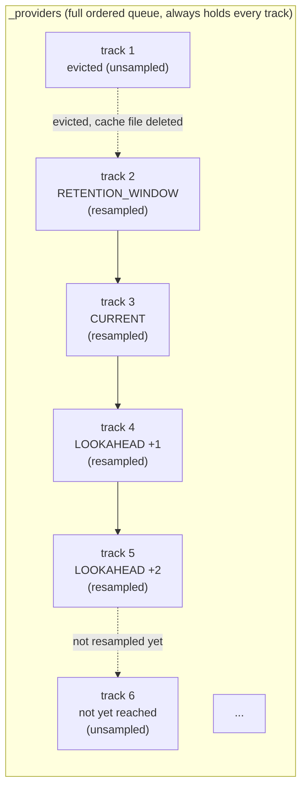
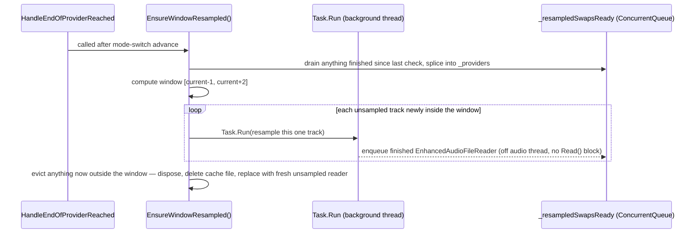

# Lazy resampled-cache window

_Category: [Playback engine](../../DOCUMENTATION_CHECKLIST.md) · Last verified against code: 2026-09-25 ·
Implemented 2026-08-19, see `KNOWN_ISSUES.md` #26, #28, #30_

## What it does

Only the current track plus a small window around it are ever resampled to disk at once — `LOOKAHEAD_WINDOW`
(2) tracks ahead, `RETENTION_WINDOW` (1) track behind. Every other queued track exists as a cheap "unsampled"
placeholder until the rolling window reaches it.

## The problem this replaced

Originally, `Player.Play()`/`AddToNowPlaying` resampled the *entire* queue — every track fully converted to a
32-bit float `.wav` and written to disk the moment it was queued, regardless of how much would actually get
listened to. The user raised this directly as the reason the target sample rate (`SAMPLE_RATE`, `KNOWN_ISSUES.md`
#4) had stayed at 44.1kHz: a long playlist chain could pin a meaningful amount of disk space for the whole
session, and raising the rate would only have made it worse.

## The window, visually

`_providers` — the display/engine list from [queue management](queue-management.md) — always holds the *entire*
queue, in order, from the very first track added. Only whether each individual entry is resampled-vs-unsampled
changes as the window moves. This was a deliberate choice over maintaining a separate "pending resample" list:
`Player.UpdatePlaybackInformation()` depends on `Providers.Count()` matching the full display list count, and
every queued track needing a valid reader to read `TotalTime`/`OriginalFilePath` off — an unsampled
`EnhancedAudioFileReader` (opened directly against the original file, no resample, no disk write) already
satisfies both, so `Player.cs` needed zero changes for this feature.

## When resampling actually happens

`EnsureWindowResampled()` is called at every track boundary (`HandleEndOfProviderReached`, after the
mode-switch advance, so it sees the *new* current) and after a manual `PlayPreviousProvider` jump. Resampling
itself always happens off the audio thread via `Task.Run` — never blocks `Read()` — and a completed resample
only gets swapped into `_providers` the *next* time `EnsureWindowResampled` runs, at the next safe boundary
(same deferred-mutation seam described in [queue management](queue-management.md)). Because a resample is
kicked off `LOOKAHEAD_WINDOW` tracks before it's needed, it has roughly a full track's playtime to finish
before playback ever reaches it — that's what keeps transitions seamless, not any wait at the boundary itself.

## Head start on add, and the RepeatAll fallback

Two edge cases needed extra handling, both documented in `KNOWN_ISSUES.md` #28:

- **Adding a track while genuinely on the last queued track:** `EnsureWindowResampled()` only runs at track
  boundaries — nothing calls it just from `AddProviders`. If there's currently no next track,
  `AddProviders` resamples the *first* newly-added track synchronously, right there (safe — this method
  doesn't run on the audio thread), rather than leaving it to sit unsampled until the current track ends and
  causing an audible pause exactly where the whole feature exists to avoid one.
- **RepeatAll wrapping back to the start of a long queue:** every other transition path guarantees
  `_currentProvider` is already resampled before it's ever set current — except wraparound, where the front of
  the queue was likely evicted many tracks ago. Landing on a genuinely unsampled `_currentProvider` and reading
  it directly would bypass the resample/upmix pipeline entirely and reintroduce the "2x speed" bug class
  (`KNOWN_ISSUES.md` #22). `EnsureWindowResampled` resamples synchronously in that one specific case — a brief
  pause, not seamless, but rare (at most once per full RepeatAll lap) and correctness-over-smoothness is the
  right trade there.

## Shuffle's "decide once" behavior change

Shuffle used to re-randomize the *entire* remaining queue on every track-end. That's incompatible with lazy
resampling: only ~3-4 tracks ever have a live provider at once, so reshuffling just that tiny window wouldn't
be a meaningful shuffle across a large playlist, and deciding "what's next" only at the exact moment the
current track ends makes resample-ahead impossible to fit in before it's needed. Shuffle order is now decided
once, the first time Shuffle mode is observed — only the not-yet-resampled remainder gets shuffled, not
whatever's already resampled ahead (that head start was already committed to disk) — then walked sequentially
through the same lazy window as every other mode. Toggling Shuffle off and back on later reshuffles fresh. See
[Playback modes](playback-modes.md).

## Cleanup

- **Eviction** (a track falling more than `RETENTION_WINDOW` behind current): dispose the resampled reader
  (closes the cache file handle), delete the cache `.wav`, replace it in-place with a fresh unsampled reader.
- **`Player.Play()` disposes the previous `DynamicPlaylistSampleProvider`** before building a new one for a new
  playlist — otherwise the old playlist's still-resampled handful of cache files would be orphaned for the rest
  of the session.
- **Dispose-time leak of an in-flight resample** (`KNOWN_ISSUES.md` #30, closed 2026-08-19): a background
  resample still running when `Dispose()` was called had nowhere to be drained — fixed by draining
  `_resampledSwapsReady` inside `Dispose(bool)`, plus a `disposedValue` check inside the background task itself
  so a resample that finishes *after* disposal cleans up after itself instead of enqueueing into a queue
  nothing will ever read again.

## Known open question

`SAMPLE_RATE` is still hardcoded at 44.1kHz. The user's original condition for reconsidering it — being able to
clear tracks behind playback — is now satisfied by this feature. Raising it is a one-constant change, but
touches what rate gets sent to the Focusrite over ASIO, a hardware/driver question rather than a pure code
change — deliberately not done without confirming that first (`KNOWN_ISSUES.md` #4).
