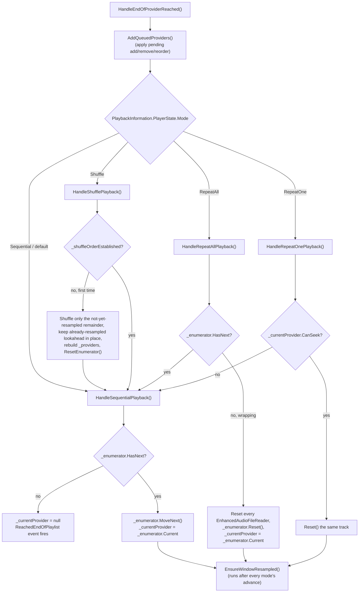

# Playback modes

_Category: [Playback engine](../../DOCUMENTATION_CHECKLIST.md) · Last verified against code: 2026-09-25_

## What it does

Four modes — Sequential, RepeatAll, RepeatOne, Shuffle — decide what happens at every track boundary. All four
are dispatched from the same place: `HandleEndOfProviderReached()` (called from `Read()` when the current
track's samples are exhausted — see [Audio pipeline](audio-pipeline.md)) calls `AddQueuedProviders()` first
(applying any pending add/remove/reorder — see [Queue management](queue-management.md)), then switches on
`Player.Instance.PlaybackInformation.PlayerState.Mode`:

## Sequential

The base case every other mode falls back to. `_enumerator` (a `PeekingEnumerator` over `_providers`) is asked
`HasNext`; if there's a next track, `MoveNext()` advances and `_currentProvider` is updated. If there isn't,
`_currentProvider` is set to `null` and the `ReachedEndOfPlaylist` event fires — carrying the tracks actually
played (`providers.Take(currentProviderIndex + 1)`), which `Player.HandleReachedEndOfPlaylist` uses to set
`HasReachedEndOfPlaylist = true` and kick off the debounced playlist-teardown described below.

## RepeatAll

Defers straight to Sequential whenever there's still a next track — RepeatAll and Sequential behave identically
except at the true end of the queue. There, instead of stopping, it resets every provider (`Reset()` on each
`EnhancedAudioFileReader`, rewinding read position), resets the enumerator to the front, and sets
`_currentProvider` back to the first track. Because a long queue's front tracks were very likely evicted from the
resample cache long ago (see [Lazy resample window](lazy-resample-window.md)), wraparound is the one case where
`EnsureWindowResampled()` resamples synchronously rather than lazily — a brief pause once per lap, traded for
correctness (an unsampled reader would bypass the resample/upmix pipeline and reintroduce the "2x speed" bug,
`KNOWN_ISSUES.md` #22).

## RepeatOne

If the current track `CanSeek`, it's just reset in place — same track plays again, no enumerator movement at
all. If it can't seek (a rare `AudioFileReader` state), it falls back to Sequential rather than getting stuck.

## Shuffle

Shuffle order is decided once, the first time Shuffle is observed at a boundary — not re-randomized on every
track-end — because lazy resampling only keeps a ~3-4 track window live at once, so re-shuffling that tiny
window wouldn't be a meaningful shuffle, and deciding "what's next" only at the exact moment the current track
ends leaves no time to resample ahead. On that first boundary: the already-resampled lookahead (committed to
disk before Shuffle was toggled on) is left in its existing order immediately after current, and only the
still-unsampled remainder is shuffled; `_providers` is rebuilt (current, then untouched lookahead, then shuffled
remainder) and `ResetEnumerator()` is called. Every boundary after that — including this first one — just calls
`HandleSequentialPlayback()`, walking the now-shuffled list like any other mode. Toggling Shuffle off and back on
later re-decides the order fresh. Full detail: [Lazy resample window § Shuffle's "decide once" behavior
change](lazy-resample-window.md#shuffles-decide-once-behavior-change).

## After the queue truly ends

Sequential/RepeatOne-with-no-seek/Shuffle-with-no-next all funnel into the same "no more tracks" path when
`_enumerator.HasNext` is false: `_currentProvider = null` and `ReachedEndOfPlaylist` fires. `Player.cs` reacts
in `HandleReachedEndOfPlaylist`:

- `HasReachedEndOfPlaylist = true` (surfaced to clients via `PlaybackInformation`)
- a 2000ms-debounced `ResetPlaylistElementsAsync` — after the debounce window, tears down `_audioPlayer`,
  disposes `_playlistProvider`, and sets `_queuedPlaylist = null`
- a 2000ms-debounced `RaisePlaybackBroadcastStopRequested`
- a 5000ms-debounced cache-file cleanup

The debounce exists so a near-simultaneous new `Play()` (e.g. the user immediately queues something else) can
cancel the teardown rather than racing it. `HandleQueuedProvidersAdded` — the event this debounce could
otherwise be paired with — is currently dead code (`private void HandleQueuedProvidersAdded(object sender,
EventArgs e) { //_queuedPlaylist.Clear(); }`, the body commented out), not an active part of this flow.

## Known constraints

- All four handlers run synchronously inside `HandleEndOfProviderReached()`, on the audio callback thread — same
  constraint as queue mutation (see [Queue management](queue-management.md) and [Audio pipeline § Known
  constraints](audio-pipeline.md#known-constraints)).
- `EnsureWindowResampled()` runs after every mode's advance, so whichever mode is active, the resample window
  keeps following `_currentProvider` — see [Lazy resample window](lazy-resample-window.md).
