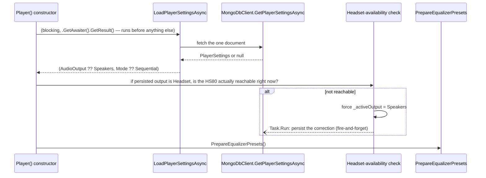

# Player settings persistence

_Category: [Playback engine](../../DOCUMENTATION_CHECKLIST.md) · Last verified against code: 2026-09-25_

## What it does

The active audio output (Speakers/Headset) and playback mode (Sequential/RepeatOne/RepeatAll/Shuffle) survive a
`MusicServer` restart — loaded once at construction, saved (fire-and-forget) every time either one changes.

## Storage shape

A single MongoDB document in the `player_settings` collection (see [Storage
map](../07-persistence-storage/storage-map.md)) — `MongoDbClient` deliberately treats it as a singleton row:
`GetPlayerSettingsAsync()` reads with an empty filter (`FirstOrDefaultAsync` — whatever's there, no key needed),
and `SavePlayerSettingsAsync(settings)` does `ReplaceOneAsync(Filter.Empty, settings, IsUpsert = true)` — it
replaces the one existing document wholesale, or inserts the first one ever. There's no history, no per-user
scoping, and no concept of multiple saved configurations; it's just "the last known good state."

## Load, at construction

The load is synchronous relative to construction (`.GetAwaiter().GetResult()`) — deliberately, since
`ApplyPersistedSettingsToPlayerState()` (called from both `InitializePlayer()` and `Play()`) needs
`_activeOutput`/`_activeMode` to already be correct, and a client can ask for `PlaybackInformation` immediately
after connecting, before any playback has started.

The Headset-availability check exists because the persisted preference can be stale from a previous session
where the HS80 was plugged in and isn't anymore: without it, the sidebar would show Headset as "active" from the
very first broadcast, even though the first actual `Play()` call would silently fall back to Speakers inside
`CreateAudioPlayer()` — a UI/reality mismatch until the user noticed and toggled it. Validating up front means
the reported state is correct from the very first broadcast, and the correction itself is persisted so the next
launch starts from Speakers too rather than re-discovering the same unavailability every time.

## Save: fire-and-forget, from three call sites

`SavePlayerSettingsAsync()` is never awaited by its callers — always `_ = Task.Run(async () =>
await SavePlayerSettingsAsync())` — so a settings-persistence hiccup (a transient Mongo error, logged and
swallowed inside the method itself) never blocks or fails the actual state change the user is waiting on:

- **`SetAudioOutput(output)`** — after a manual switch (see [Audio output
  switching](audio-output-switching.md)), and also from the constructor's Headset-availability correction above.
- **`TogglePlaybackMode()`** — after cycling to the next [playback mode](playback-modes.md).

Each save writes the *current* combination of both fields (`new PlayerSettings { AudioOutput = _activeOutput,
Mode = _activeMode }`), not just whichever one changed — so the single-document replace always reflects both
values consistently, never a partial update.

## Known constraints

- Genuinely single-user: there's no concept of "whose" settings this is. Fine for a personal self-hosted player,
  but worth knowing if multi-user support is ever considered.
- A save failure is logged and otherwise invisible — the in-memory state (`_activeOutput`/`_activeMode`,
  already updated by the time the save is kicked off) is correct for the rest of the session regardless; only
  the *next restart* would silently miss the latest change.
