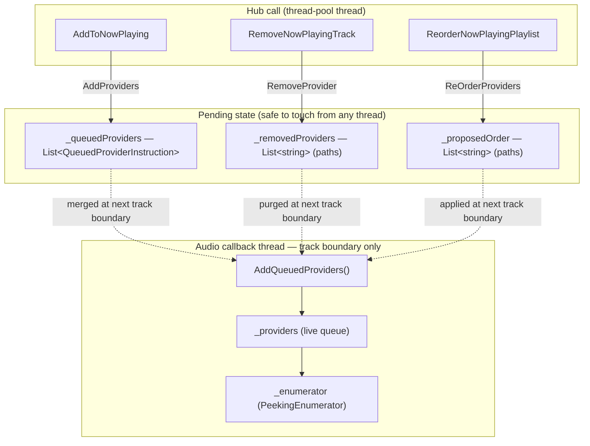
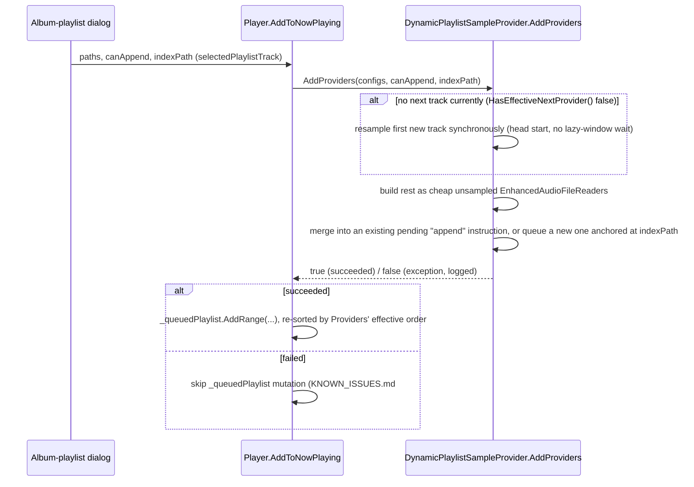

# Now-playing queue management

_Category: [Playback engine](../../DOCUMENTATION_CHECKLIST.md) · Last verified against code: 2026-09-25_

## What it does

Adding, removing, and reordering tracks in the live Now Playing queue, from `Player.AddToNowPlaying` /
`RemoveNowPlayingTrack` / `ReorderNowPlayingPlaylist` down to `DynamicPlaylistSampleProvider`'s internal queue
state.

## The core constraint: the queue is read from the audio callback thread

`DynamicPlaylistSampleProvider.Read()` runs synchronously on the ASIO/WASAPI audio callback thread (see
[Audio pipeline architecture](audio-pipeline.md)). Mutating `_providers`/`_enumerator` directly from a hub
call (which runs on an arbitrary thread-pool thread) while `Read()` might be mid-iteration over them is unsafe.
So every mutation — add, remove, reorder — is **deferred**: recorded into a pending field immediately, but only
actually applied to `_providers`/`_enumerator` at the next safe point, which is a track boundary
(`HandleEndOfProviderReached`, itself running on the audio thread, so the mutation happens *on* that thread,
just not *mid-`Read()`*).

`AddQueuedProviders()` — called from `HandleEndOfProviderReached`, right after `AddQueuedProviders()` and
before the mode-switch advance — applies all three pending operations independently (each runs whenever it has
pending work, not nested inside another), rebuilds `_providers`, and calls `ResetEnumerator()`.

## Why "effective" state exists separately from real state

Between when you click Add/Remove/Reorder and the next track boundary, `_providers` itself hasn't changed yet
— but the frontend, and `Player.UpdatePlaybackInformation()`'s polling, need to know the queue's state *as if*
the pending operation had already applied, immediately. `Providers` (the public property) is computed on every
access via `GetProviders()`: takes `_providers`, subtracts anything in `_removedProviders`, and merges in
anything from `_queuedProviders` at its resolved anchor position — so `HasNextProvider`, the displayed track
count, and `Player`'s own guard logic all see the *effective* queue immediately, without waiting for a track
boundary.

## Add: anchoring and the append/insert distinction

`AddProviders(configs, canAppend, indexPath)` is the one operation with real subtlety. `indexPath` names the
track to insert relative to; `canAppend` decides whether the new tracks land *after* that track (`canAppend =
true`, via a custom `AddRange(index, ...)` extension that inserts after, not before) or *before* it
(`InsertRange`). A `null`/empty `indexPath` means "the true end of the queue" — resolved fresh at merge time
via `providers.Count`, so it's immune to the queue having grown or shrunk in the meantime.

**In practice, the frontend always sends a real `indexPath`** — the album-playlist dialog auto-selects the
last track in Now Playing as a default anchor, then sends that path even when the user hasn't deliberately
picked an insertion point. That default can go stale if real time passes before the actual Append click (see
`KNOWN_ISSUES.md` #32 for the bug this causes: a stale anchor that's since been played inserts new tracks
*behind* the current playback position instead of at the true end, making them unreachable in Sequential mode
until the real remaining queue plays out).

`AddProviders` returns `bool` rather than `void` specifically so `Player.AddToNowPlaying` can tell whether the
add actually landed before touching the display list (`_queuedPlaylist`) — see `KNOWN_ISSUES.md` #30. Before
that fix, a silent internal failure (anything the method's own catch-all swallowed) still left the display
list showing tracks the real engine queue never got, permanently tripping the count-mismatch guard described
below.

## `UpdatePlaybackInformation`'s count-mismatch guard

`Player._queuedPlaylist` (the flat display list broadcast to clients) and `_playlistProvider.Providers` (the
engine's effective queue) are two different lists that have to stay reconcilable. `UpdatePlaybackInformation`
only bails when `_queuedPlaylist.Count > Providers.Count()` — that's the genuinely unsafe case, where looking
up a `_queuedPlaylist` track in `Providers` via `.First(...)` could throw (no match found, e.g. mid-merge right
after an add, before the pending instruction is reflected). The reverse — `Providers` temporarily containing
*more* than `_queuedPlaylist` (e.g. right after a remove, before the deferred purge catches up) — is safe to
proceed with, since every `_queuedPlaylist` entry is still guaranteed findable. This asymmetric guard is the
fix for what used to be a much worse bug: any mismatch at all froze every playback field (`IsPlaying`,
`HasNext`, durations, the whole `Tracks` list) until the next track boundary happened to resolve it — see
`KNOWN_ISSUES.md` #12.

## Remove

`RemoveProvider(paths)` adds the paths to `_removedProviders` (subtracted from `Providers` immediately, purged
from `_providers` for real at the next boundary) and also purges them from any still-pending `_queuedProviders`
instruction, so a track deleted before its pending add ever merged doesn't leave a dead duplicate queued to be
added anyway.

## Reorder

`ReOrderProviders(paths)` just stashes the new order in `_proposedOrder` — applied to the real queue at the
next track boundary, same as add/remove. This is deliberate, not a bug: reordering the *actual* playback
sequence mid-track would mean reordering `_providers` while the enumerator might be mid-read from it. The
*displayed* order (`_queuedPlaylist`, updated synchronously by `Player.ReorderNowPlayingPlaylist`) updates
immediately regardless, so the UI reflects the reorder right away even though what plays next when the current
track ends is still whatever the pre-reorder order said until the boundary catches up — see `KNOWN_ISSUES.md`
#10.
