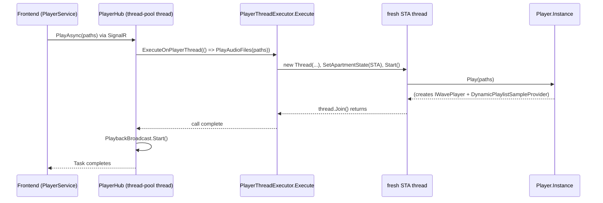

# Transport controls and STA threading

_Category: [Playback engine](../../DOCUMENTATION_CHECKLIST.md) · Last verified against code: 2026-09-25_

## What it does

`PlayerHub` (SignalR) exposes the transport surface — play, pause, next, previous, mode toggle, output switch,
plus queue add/remove/reorder and equalizer preset apply — and marshals every call that actually touches the
live audio pipeline onto a dedicated STA thread before invoking `Player.Instance`.

## Why a dedicated STA thread

`AsioOut` and `WasapiOut` (NAudio's wrappers around the Focusrite/Corsair outputs — see [Audio
pipeline](audio-pipeline.md)) are COM-based and expect to be driven from an STA (single-threaded apartment)
thread. A SignalR hub method runs on an arbitrary ASP.NET Core thread-pool thread — not STA — so calling into
`Player.Instance.Play()`/`Pause()`/etc. directly from a hub method would be invalid from COM's perspective.

`MusicServer/Helpers/PlayerThreadExecutor.cs` centralizes the fix: `Execute(Action, Action<Exception>)` spins up
a brand-new `Thread`, sets `ApartmentState.STA`, runs the action, and `Join()`s — blocking the caller until it
finishes. Nothing is pooled; every call gets its own throwaway STA thread. This used to be `PlayerHub`'s own
private `ExecuteOnPlayerThread` method; it was pulled out into a shared static class specifically so
[`AudioOutputAvailabilityBroadcast`](audio-output-switching.md) — a background loop with no SignalR hub instance
of its own — could get the same STA guarantee for a server-initiated output switch (e.g. the active device
disappearing while nothing is playing).

`PlayerHub`'s own `ExecuteOnPlayerThread(Action action)` wraps `PlayerThreadExecutor.Execute`, passing an
`onError` that forwards any exception to all clients as a `ReceivePlayerHubError` SignalR message.

## Hub methods, and what runs where

| Method | Marshaled to STA thread? | Notes |
|---|---|---|
| `InitializePlayerAsync` | yes | also starts `AudioOutputAvailabilityBroadcast` |
| `PlayAsync(paths?)` | yes | `null` paths resumes; otherwise plays the given files. Starts `PlaybackBroadcast` afterward |
| `PauseAsync` | yes | |
| `PlayNextAsync` / `PlayPreviousAsync` | yes | |
| `TogglePlayerModeAsync` | yes | cycles [playback mode](playback-modes.md) |
| `ReorderNowPlayingAsync(paths)` | yes | broadcasts `PlaybackInformation` immediately afterward — see below |
| `RemoveNowPlayingTrackAsync(paths)` | yes | same immediate-broadcast reasoning |
| `AddToNowPlayingAsync(paths, canAppend, indexPath)` | yes | see [Queue management](queue-management.md); `indexPath` staleness is `KNOWN_ISSUES.md` #32 |
| `SetEqualizerPresetsAsync(preset)` | yes | applies gains live, no playback restart — see [Equalizer](equalizer.md) |
| `SetAudioOutputAsync(output)` | yes | swaps the `IWavePlayer` under the same provider instance; broadcasts immediately afterward |
| `GetEqualizerPresetsAsync`, `GetEqualizerManagementDataAsync`, `CreateEqualizerPresetAsync`, `UpdateNamedEqualizerPresetAsync`, `DeleteEqualizerPresetAsync`, `GetTrackEqualizerPresetAsync`, `UpdateTrackEqualizerPresetAsync`, `DeleteTrackEqualizerPresetAsync` | **no** | plain Mongo/JSON I/O, doesn't touch `_playlistProvider`/`_audioPlayer` |
| `GetTrackLyricsAsync`, `SaveManualLyricsAsync` | **no** | plain Mongo I/O (plus an occasional LRCLIB round-trip on cache miss) |

## Immediate broadcast after paused-state mutations

`PlaybackBroadcast`'s loop (`MusicServer/Startup/PlaybackBroadcast.cs`) only runs while something is actually
playing — a 500ms `PeriodicTimer`, started by `PlayAsync` and stopped via `Player.PlaybackBroadcastStopRequested`
(see [Playback modes § After the queue truly ends](playback-modes.md#after-the-queue-truly-ends)). If the player
is paused or stopped, that loop isn't running — so `ReorderNowPlayingAsync`, `RemoveNowPlayingTrackAsync`, and
`SetAudioOutputAsync` each call `SendPlaybackInformationAsync()` directly, right after their STA-marshaled
mutation, instead of relying on the tick loop. Without this, reordering, deleting, or switching output while
paused would update the backend state correctly but never reach the UI until playback resumed.

`PlaybackBroadcast`'s own tick also tracks `_lastSentPlayingTrackPath` to send cover art only on the tick the
playing track actually changes (every other tick sends `Image: null`, and the frontend carries forward whatever
it already has) — this replaced an earlier design where a separate `CurrentTrackChanged` event could race the
tick loop's own send and have a trimmed, image-less payload land after the real one (`KNOWN_ISSUES.md` #19).

## No Seek method

`DOCUMENTATION_CHECKLIST.md`'s Category 1 bullet names "play/pause/next/previous/seek," but no Seek method
exists on `PlayerHub` — confirmed by grep across the hub for `Seek`/`ExecuteOnPlayerThread`. The frontend's
seekbar (`player.service.ts`'s `seekbarPlayingTrack$`) is a read-only progress display driven by
`PlaybackInformation.PlayedDuration` on each broadcast tick, not an interactive scrubber — there's no way to
jump to an arbitrary position in a track today.

## Known constraints

- Every STA call spins up and tears down a brand-new thread — simple and safe, but not free; this is
  acceptable because transport actions are infrequent relative to the 500ms broadcast tick, not something
  happening many times a second.
- `ExecuteOnPlayerThreadAsync` (an `async`-lambda variant, also in `PlayerHub.cs`) exists but is unused by any
  current hub method — every method above uses the synchronous `ExecuteOnPlayerThread`/`PlayerThreadExecutor`
  path instead.
