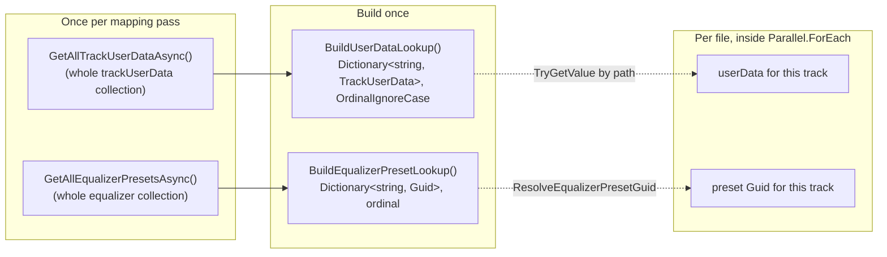

# Mapping-time bulk lookups

_Category: [Library & mapping](../../DOCUMENTATION_CHECKLIST.md) · Last verified against code: 2026-09-25_

## What it does

Every mapping entry point ([full scan](full-mapping-pipeline.md), [single-album
refresh](single-album-refresh.md), `GetCreatedAlbumAsync`) needs, for every track it processes, that track's
favourite/times-played state and its assigned equalizer preset GUID. Rather than a Mongo round trip per track,
each entry point fetches its whole (small) collection **once** and builds an in-memory dictionary, then does a
synchronous lookup per track against that dictionary.

## The N+1 problem this replaced

Originally, per-track equalizer preset resolution (`GetTrackEqualizerPresetGuidAsync`) and (in an earlier
version) favourite lookups queried Mongo once per file — for a library of any real size, that's hundreds or
thousands of individual round trips per mapping pass. `KNOWN_ISSUES.md` #5 flagged this as still open after an
earlier mapping-performance pass fixed other issues in the same area; #30 closed the equalizer half
specifically.

## The two lookups

- **`BuildUserDataLookup(IEnumerable<TrackUserData>)`** — groups by `Path` using `StringComparer.OrdinalIgnoreCase`
  before building the dictionary (`GroupBy(...).ToDictionary(..., StringComparer.OrdinalIgnoreCase)`), so a
  path's casing drifting between when a track was favourited and now can't cause a lookup miss. Windows
  filesystems are case-insensitive but case-preserving — exactly the mismatch that could otherwise make a
  favourite appear to silently reset. `GroupBy`+`First` (rather than a plain `ToDictionary`, which throws on a
  duplicate key) also means a stray duplicate path in the collection can never crash a library load — it just
  silently keeps whichever entry it saw first. The `trackUserData` collection's own case-insensitive collation
  (set up in `MongoDbClient.EnsureCollectionsExistAsync`) closes the same gap at the storage layer too — see
  [Track user data](track-user-data.md).
- **`BuildEqualizerPresetLookup(IEnumerable<EqualizerPreset>)`** — same batching fix, same `GroupBy`+`First`
  crash-avoidance, but keyed by `Name` with plain ordinal comparison (not case-insensitive) — named presets and
  per-track custom overrides (whose `Name` is the track's own path) share one collection, matching how
  `GetEqualizerPresetAsync(name)` already looks presets up elsewhere. This hasn't had a reported path-casing
  issue the way `trackUserData` did, so it was deliberately left ordinal rather than changed beyond the
  batching itself.

`ResolveEqualizerPresetGuid(path, existingGuid, presetLookup)` is the actual per-track call site: if the track
already carries an assigned `EqualizerGuid` forward from the previous mapping (`existingGuid != Guid.Empty`),
that's kept as-is, no lookup needed at all — the dictionary is only consulted for tracks that don't have one
yet.

## Who calls these

`GetAlbumsAsync()`, `RefreshAlbumAsync()`, and `GetCreatedAlbumAsync()` (via `MapAlbumMetaData`'s callers) each
fetch and build both dictionaries fresh, once, at the start of their own mapping pass — the dictionaries aren't
shared or cached across calls, since each pass wants an up-to-date snapshot at the moment it runs, and the
underlying collections are small enough that re-fetching per pass is still far cheaper than the old per-track
round trips it replaced.

## Known constraints

- Both dictionaries are snapshots taken at the start of a mapping pass — any favourite/preset change that
  happens *during* a long-running full scan won't be reflected in that same pass's results (it'll be picked up
  next time). In practice mapping passes are fast enough, and the live-overlay mechanism (see [Track user
  data](track-user-data.md) and [Cache-load pass](cache-load-pass.md)) already covers the read paths most
  likely to show state that changed after the fact.
- These are mapping-time lookups only — the separate `ApplyLiveTrackUserDataAsync` overlay (used by the
  cache-load read paths, which don't run a mapping pass at all) rebuilds its own `userDataLookup` independently
  via the same `BuildUserDataLookup` helper.
