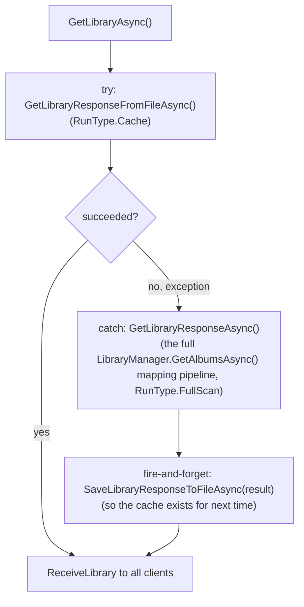

# Cache-load mapping pass

_Category: [Library & mapping](../../DOCUMENTATION_CHECKLIST.md) · Last verified against code: 2026-09-25_

## What it does

Every normal app load takes a fast path — `LibraryHub.GetLibraryAsync()` deserializes the per-album AppData
JSON cache files straight off disk, skipping the [full mapping pipeline](full-mapping-pipeline.md)'s expensive
per-file tag/image extraction entirely. The full scan only runs as a fallback when the cache read fails.

## The two run types

`MappingUpdate.RunType` (`MappingRunType.Cache` vs `MappingRunType.FullScan`) tags which path produced a given
mapping run, so both the live progress view and the persisted run-history table (see [Mapping
statistics/history](mapping-statistics.md)) can distinguish "read from disk cache" from "actually re-scanned
the library." Both paths populate the same `MappingUpdate` object the same way (reset `IsComplete`/`Error`,
start a once-a-second CPU/memory sampling `Timer`, report progress via `Message`/`MappedDirectories`) — the
`RunType` tag and the actual work inside the loop are the only differences.

## What the cache path actually does

`GetLibraryResponseFromFileAsync()`:

1. Resets `MappingUpdate` and tags it `RunType.Cache`, same as a full scan.
2. Starts the same once-a-second CPU/memory `Timer` a full scan uses — this path turned out to take roughly 10
   seconds in practice (deserializing every cached album JSON file), not the sub-second turnaround originally
   assumed when it was built without any progress sampling, so it warrants the same live progress reporting a
   full scan gets rather than a single one-shot reading.
3. Enumerates every file in the AppData cache directory matching the GUID-named JSON pattern
   (`Constants.JSON_FILE_PATTERN`/`GUUID_FILE_PATTERN`) and deserializes each one in parallel
   (`Parallel.ForEachAsync`) into an `Album`, collected into a `ConcurrentBag<Album>`.
4. If zero albums came back, throws — this is what triggers the full-scan fallback in `GetLibraryAsync()`
   above (an empty or missing cache directory, e.g. first run ever, or after `ClearLocalCacheAsync`).
5. Applies `LibraryManager.ApplyLiveTrackUserDataAsync(albums)` — a live overlay of `IsFavourite`/`TimesPlayed`
   from the `trackUserData` collection, over top of whatever those fields happened to be the last time each
   album was mapped/refreshed. Without this, the library grid (the single most common view in the app) would
   show stale favourite state any time a favourite was toggled through a view other than the one that mapped
   it last — this was `KNOWN_ISSUES.md` #29, and the same overlay is applied in `GetSelectedAlbumAsync()` for
   the same reason on the album-detail page. See [Track user data](track-user-data.md).

## Fallback: full scan + re-cache

If the cache read throws for any reason (corrupt/missing files, the "no albums found" guard above, or any
other exception), `GetLibraryAsync()` catches it, logs, broadcasts a `MappingUpdate` error and status message,
then calls `GetLibraryResponseAsync()` — the actual [full mapping pipeline](full-mapping-pipeline.md) — and
fires off `SaveLibraryResponseToFileAsync(libraryResponse)` in the background afterward so the cache is
populated again for the *next* load. The user sees a slower load this one time, with no separate action needed.

## Known constraints

- The cache-path overlay (`ApplyLiveTrackUserDataAsync`) only corrects `IsFavourite`/`TimesPlayed` — any other
  field that drifted between when an album was last mapped and now (a track added/removed on disk, a changed
  tag) still requires an explicit [single-album refresh](single-album-refresh.md) or full re-scan to pick up.
- `GetSelectedAlbumAsync()` has the identical staleness problem and identical fix, but as a separate code path
  reading a single album's cache file directly (not through `GetLibraryResponseFromFileAsync`) — the two
  overlay call sites have to be kept in sync by hand if a new stale field is ever discovered.
