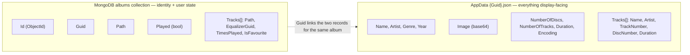

# Display metadata split (AppData JSON vs Mongo)

_Category: [Library & mapping](../../DOCUMENTATION_CHECKLIST.md) · Last verified against code: 2026-09-25_

## What it does — and why this is worth its own explainer

`Album` and `Track` display fields — `Name`, `Artist`, `Genre`, `Year`, `Image`, `Duration`, `TrackNumber`,
`DiscNumber`, `NumberOfDiscs`, `NumberOfTracks`, `Encoding` — are marked `[BsonIgnore]` and **never written to
MongoDB at all**. They exist only in a per-album JSON file mirror in AppData (see [Storage
map](../07-persistence-storage/storage-map.md)). This is probably the single most surprising thing about this
system's persistence layer to a newcomer reading the Mongo `albums` collection expecting to find an album's
name in it — it isn't there.

## What's `[BsonIgnore]`, and what isn't

`Album.Id`/`Guid`/`Path`/`Played` and each `Track.Path`/`EqualizerGuid`/`TimesPlayed`/`IsFavourite` are real
Mongo fields — genuine persisted state the app reads and writes through normal Mongo queries (album lookup by
path, [track user data](track-user-data.md) writes, equalizer assignment). Everything else — every field a
user would actually look at on screen — is `[BsonIgnore]`d and lives only in the JSON file.

## Why the split exists

Cover art alone (`Image`, a base64-encoded string) can be substantial per album, and every mapping pass already
produces a complete, ready-to-serialize `Album` object as its natural output — writing that whole object
straight to a flat JSON file per album is far cheaper than shaping it into normalized Mongo documents with
separate image storage, and the JSON file is exactly the shape the frontend wants back (`GetSelectedAlbumAsync`,
the [cache-load pass](cache-load-pass.md)) with zero transformation. Mongo instead holds only the fields that
need to be *queried* — looked up by path, updated atomically, joined against `trackUserData`/`equalizer` — which
none of the display fields ever are; nothing in the codebase filters, sorts, or searches by track name or
duration at the database level, so there's no query-shape reason for them to live in Mongo at all.

## The consequence: two records per album, linked by Guid

Every album's full state is really **two files that have to be kept in sync by the same write path**: a Mongo
document (identity + queryable user state) and an AppData JSON file (display data), linked by `Album.Guid` —
not `Album.Id`. This is exactly the coupling that caused the Singles duplicate-card bug (`KNOWN_ISSUES.md` #25):
a refresh that generated a fresh `Guid` instead of carrying the existing one forward wrote a *new* JSON file
under a new filename, orphaning the old one, even though the Mongo document itself updated correctly. See
[Album cache file identity](../07-persistence-storage/album-cache-identity.md) for the full incident.

Every mapping entry point ([full scan](full-mapping-pipeline.md), [single-album
refresh](single-album-refresh.md), [Singles grouping](full-mapping-pipeline.md#the-singles-pseudo-album))
writes both records from the same in-memory `Album` object it just built, in the same pass — there's no
separate reconciliation step; the split only becomes visible when reading the two back independently (which
`GetSelectedAlbumAsync` and the cache-load path both do, since they read the JSON file straight off disk
without touching Mongo for display fields at all).

## Known constraints

- Because `Name`/`Artist`/etc. never reach Mongo, any admin tooling or Mongo Compass poke that expects to find
  an album's title in the `albums` collection will come up empty — this is not a bug, but it looks like one on
  first glance.
- The two records can only drift apart via the `Guid`-mismatch failure mode described above; there's no
  built-in periodic consistency check between them beyond `RemoveOrphanedAlbumCacheFiles`' targeted cleanup
  during a single-album refresh.
