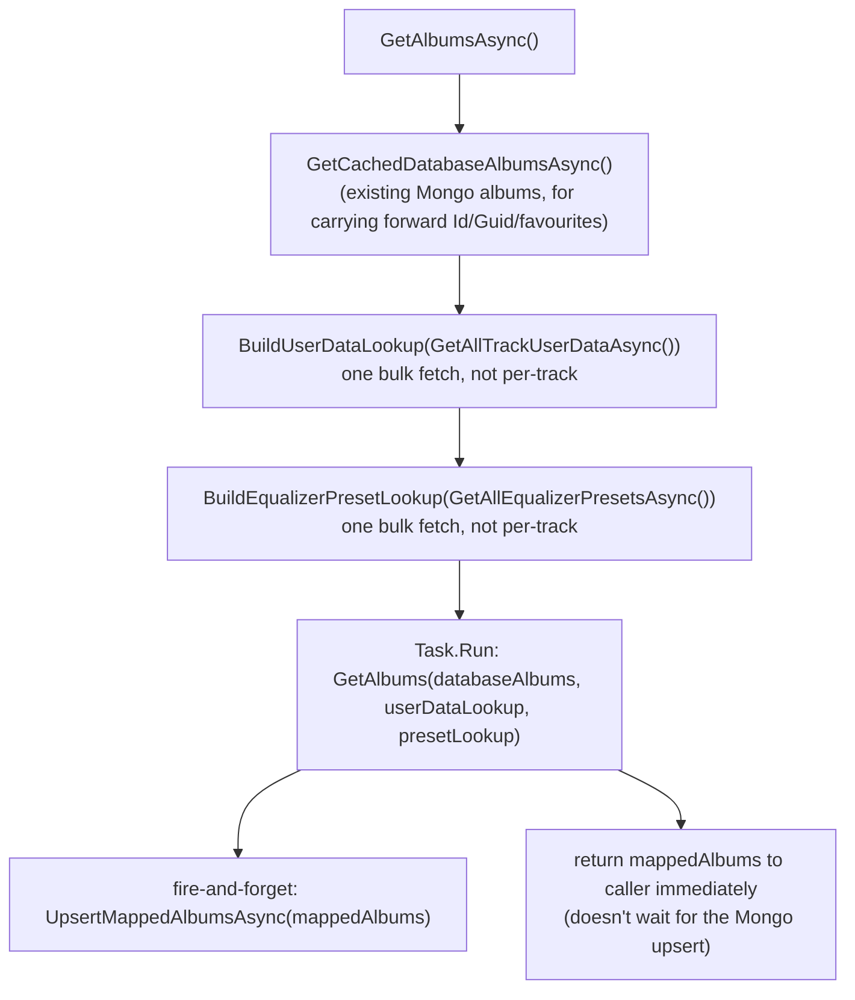
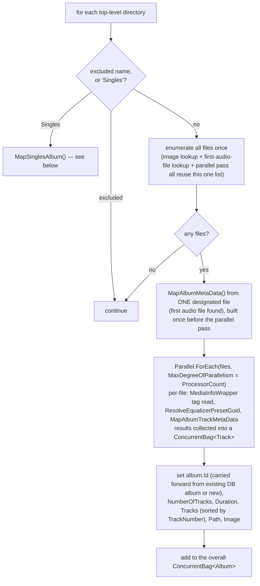

# Full library mapping pipeline

_Category: [Library & mapping](../../DOCUMENTATION_CHECKLIST.md) · Last verified against code: 2026-09-25_

## What it does

`LibraryManager.GetAlbumsAsync()` walks the entire music library directory, extracts tag/image metadata for
every audio file, and produces the full list of `Album` objects that back the library grid — a "FullScan" run,
as opposed to the fast [cache-load pass](cache-load-pass.md) most normal app loads take instead.

## Top-level flow

`GetAlbumsAsync` returns as soon as the in-memory mapping pass finishes — persisting the result to MongoDB
(`UpsertMappedAlbumsAsync`, a single `BulkWriteAsync`) happens in the background afterward, not blocking the
response the frontend is waiting on.

## Directory walk

`GetAlbums()` (the actual mapping work, run via `Task.Run` off the caller's thread) enumerates every top-level
directory under `Constants.LIBRARY_DIRECTORY`, sequentially — deliberately not in parallel. Only the *file*
level inside each directory is parallelized (`Parallel.ForEach`, bounded to `Environment.ProcessorCount`).
Stacking two unbounded parallel loops (one over directories, one over files inside each) was the original
design and oversubscribed the thread pool instead of speeding anything up — fixed as part of `KNOWN_ISSUES.md`
#5.

A small set of directory names are excluded outright (`_directoryExclusions`: `beats`, `Edits`, `iTunes`,
`Playlists`, `Dump`, `Resampled Providers`, `Staging`) — non-music folders that happen to live alongside the
library.

## Per-directory mapping

Album-level metadata (`MapAlbumMetaData`) is built **once, deterministically**, from a single designated file
(the first audio file found in the directory) before the parallel file pass starts — not lazily inside the
parallel loop the way it originally worked (`if (album == null) album = ...`, a genuine data race: multiple
file-processing threads could pass that null check simultaneously and each construct a competing `Album`
instance). This ordering fix is part of `KNOWN_ISSUES.md` #5.

Each file's per-track equalizer preset GUID is resolved via `ResolveEqualizerPresetGuid` against the
pre-fetched `presetLookup` dictionary — a synchronous, in-memory lookup rather than a per-file Mongo round trip
(see [Mapping-time bulk lookups](bulk-lookups.md)). Same treatment for `userDataLookup` (favourites/times
played).

An album is skipped entirely (`continue`, nothing added) if its name is null or its resolved artist is
`"Unknown"` — a signal the directory didn't actually contain a recognizable album.

## The "Singles" pseudo-album

A directory literally named `Singles` is handled by a dedicated path, `MapSinglesAlbum()`, rather than the
generic per-directory logic above — every loose track that doesn't belong to a real album lives there, grouped
into one synthetic `Album` with fixed metadata (`Name = "Singles"`, `Artist = "Various Artists"`, `Genre =
"Various"`, `NumberOfDiscs = 1`) rather than metadata derived from any one file. Track-level mapping
(`MediaInfoWrapper`, preset/user-data lookups, `MapAlbumTrackMetaData`) is otherwise identical to the generic
path, just without the per-directory artist/album consistency the generic path assumes.

`MapSinglesAlbum` explicitly carries the existing album's `Guid` forward (`savedAlbum?.Guid ?? Guid.NewGuid()`)
— `Album.Guid` (a separate field from the Mongo `Id`, defaulting to a fresh random value on every `new Album
{...}`) drives the per-album AppData JSON cache filename. Without carrying it forward, every Singles re-scan
would write a brand-new cache file under a new Guid instead of overwriting the existing one, leaving the old
file as an orphan — this was the root cause of a duplicate "Singles" card in the library grid, fixed in
`KNOWN_ISSUES.md` #25. See [Album cache file identity](../07-persistence-storage/album-cache-identity.md) for
the full story.

## Resource sampling during the run

`GetAlbums()` wraps the whole scan in a `System.Threading.Timer` that samples process-level (not system-wide)
CPU% and working-set memory once a second, feeding `MappingUpdate` — the same object `MusicServer`'s
`MappingUpdateBroadcast` picks up and forwards to clients live. The timer is scoped to the `using` block around
the scan (`Dispose()`d automatically whether the scan finishes normally or throws), so sampling only runs for
the duration of an actual mapping pass, not continuously. See [Mapping statistics/history](mapping-statistics.md).

## Known constraints

- A file that throws during per-track mapping (a corrupt tag, an unreadable file) is caught, logged, and
  recorded into `MappingUpdate.Error` — but doesn't abort the run; the rest of the directory (and library)
  continues mapping. The album itself simply ends up missing that one track.
- `UnauthorizedAccessException` and `DirectoryNotFoundException` at the top level *do* abort the whole run —
  logged, recorded into `MappingUpdate.Error`, and rethrown to the caller.
- MusicPlayer targets .NET Framework 4.8 / C# 7.3, so `Parallel.ForEachAsync` isn't available (hence
  `Parallel.ForEach` with a synchronous per-file body) and C# 8 `using` declarations are avoided in favor of
  classic `using(){}` blocks.
