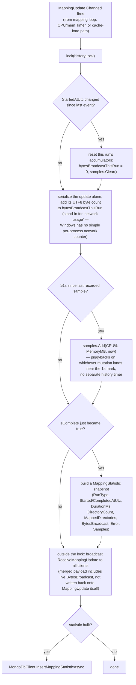

# Mapping statistics / history

_Category: [Library & mapping](../../DOCUMENTATION_CHECKLIST.md) · Last verified against code: 2026-09-25_

## What it does

Every mapping run — [full scan](full-mapping-pipeline.md) or [cache load](cache-load-pass.md) — pushes live
progress (percent complete, current directory, CPU/memory) to connected clients while it runs, and gets
persisted as a `MappingStatistic` history entry the moment it completes, feeding the Settings > "Mapping
Statistics" tab's tables and bar charts.

## `MappingUpdate`: the live, event-raising model

`LibraryManager.Instance.MappingUpdate` is a single long-lived object (not recreated per run) whose every
property setter calls `OnChanged()`, raising a plain C# `Changed` event — the same event-bridge pattern used
elsewhere to avoid `MusicPlayer` needing a direct reference to `MusicServer`'s SignalR hubs (see [Event-bridge
pattern](../05-realtime-sync/event-bridge-pattern.md)). `StartedAtUtc` is set once at the start of a run and
never re-ticked — the client derives elapsed time from that timestamp itself rather than the server pushing a
separately-updating `ElapsedMs` field. `RunType` (`FullScan`/`Cache`) is set alongside it, letting the live view
and history distinguish the two. `Percent` is a computed property (`MappedDirectories / DirectoryCount * 100`),
not a stored field.

## `MappingUpdateBroadcast`: forward live, persist on completion

`MusicServer/Startup/MappingUpdateBroadcast.cs` subscribes to `MappingUpdate.Changed` once, at startup — no
polling timer, no shared-state guessing; every mutation anywhere in a mapping pass (the directory loop, the
CPU/memory sampling `Timer`, the cache-load path) fires this handler directly.

A `lock(historyLock)` protects the run-accumulator bookkeeping (`bytesBroadcastThisRun`, `samples`,
`currentRunStartedAt`) since `Changed` can fire from several different threads in close succession — the
mapping `foreach` loop, the CPU/memory `Timer` callback, and the cache-load path's own event source can all be
in flight around the same moment. The lock is only ever held across synchronous bookkeeping, never across an
`await` (can't lock across an `await` in C# anyway) — the actual broadcast and Mongo insert happen after the
lock is released.

**Never written back onto the `MappingUpdate` instance itself** — the live `BytesBroadcast` figure is merged
into a separate anonymous object for the outgoing broadcast payload rather than assigned as a new property on
`update`, because a `Changed` handler mutating the very instance that raised the event would re-trigger
`Changed` recursively.

## Persisted history: `MappingStatistic`

A `MappingStatistic` document (Mongo `mapping_statistics` collection — see [Storage
map](../07-persistence-storage/storage-map.md)) is only ever built and inserted the moment `IsComplete`
transitions to `true` — a run that throws (see the [full mapping pipeline](full-mapping-pipeline.md)'s
`UnauthorizedAccessException`/`DirectoryNotFoundException` handling) never sets `IsComplete`, so it's silently
skipped from history rather than saved half-done. Each document carries `RunType`, start/completion timestamps,
computed `DurationMs`, directory counts, the accumulated `BytesBroadcast`, any `Error` message, and the full
list of once-a-second `MappingStatisticSample` readings (timestamp/CPU%/memory) taken during that run — enough
for the Settings tab to render both summary tables and a CPU/memory-over-time chart per run.

This collection deliberately uses explicit snake_case `[BsonElement]` names (`run_type`, `started_at`, ...)
rather than the Mongo driver's PascalCase default that `Album`/`Playlist`/`EqualizerPreset` rely on — a
convention chosen specifically for this newer collection, not a retrofit of the older models. `Id` uses the
same `ObjectIdConverter` as `Album.Id` so Newtonsoft serializes it as a plain string rather than a nested
`{Timestamp, Machine, Pid, ...}` object, matching the Angular side's `id: string` field.

## CPU/memory sampling: one shared mechanism, two producers

Both mapping run types sample process-level (not system-wide) CPU% and working-set memory once a second via a
`System.Threading.Timer` scoped to the run's `using` block — see [Full mapping
pipeline](full-mapping-pipeline.md) and [Cache-load pass](cache-load-pass.md) for where each one lives. The
history recorder above doesn't run its own independent sampling timer for history purposes; it just captures
whatever `MappingUpdate.CpuPercent`/`MemoryMb` happen to be carrying whenever a `Changed` event lands near the
1-second mark.

## Known constraints

- `BytesBroadcast` is a byte-count of the update payloads actually sent, not a true network-layer measurement —
  chosen as an exact, zero-dependency stand-in specifically because Windows has no simple per-process network
  counter the way it does for CPU/memory via `PerformanceCounter`.
- A run's accumulators reset on `StartedAtUtc` changing — if two runs somehow started with the exact same
  timestamp (not expected in practice, `DateTime.UtcNow` resolution), history bookkeeping could misattribute
  samples between them.
