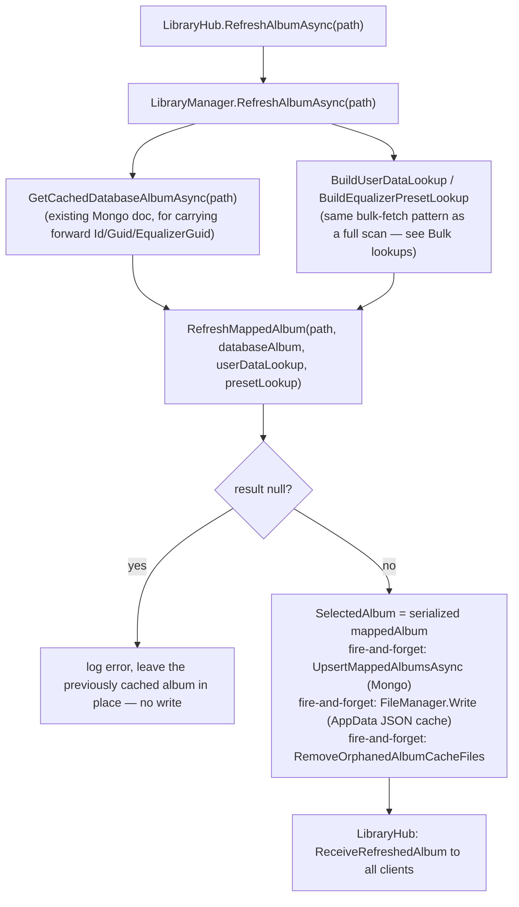

# Single-album refresh

_Category: [Library & mapping](../../DOCUMENTATION_CHECKLIST.md) · Last verified against code: 2026-09-25_

## What it does

`LibraryHub.RefreshAlbumAsync(path)` re-maps one album (a single directory) without running the full library
scan — the "Refresh Album" button on an album detail page, for when a track was added/changed/removed on disk
and the user doesn't want to wait for (or trigger) a full [library mapping pass](full-mapping-pipeline.md).

## Flow

## How it diverges from the full mapping pass

`RefreshMappedAlbum` is a distinct method from `GetAlbums()` (the full-scan per-directory logic), not the same
code called with a narrower directory list — the two have to be kept consistent by hand. Key differences:

- **Singles check happens first, and checks the directory *name*, not the full path.** This was a real bug,
  fixed along the way: the check used to compare the full absolute path against the literal string `"Singles"`
  (e.g. `"D:\Music\Singles"` against `"Singles"`), which never matched — every Singles refresh fell through to
  the generic single-album branch instead, which derives the album's `Name`/`Artist` from whichever track
  happens to enumerate first in the folder. That silently overwrote `"Singles"` / `"Various Artists"` with some
  random track's own tags on every refresh (a loose single by one artist becoming the whole pseudo-album's
  displayed name). Fixed to check `directoryInfo.Name` instead, matching the check `GetAlbums()` already used
  correctly for the same folder during a full scan.
- **The Singles/exclusion/empty-directory checks happen before any file enumeration** — the full scan's
  per-directory loop only skips directory *exclusions* early; `RefreshMappedAlbum` also bails before walking
  the tree or scanning for images at all when the directory turns out to be excluded or empty, since (for a
  single targeted refresh) that work would otherwise be done and immediately thrown away.
- **No resource-usage sampling `Timer`** — that machinery exists in `GetAlbums()`/the cache-load pass to feed
  the live progress view and mapping-history table across a run that can take real time; a single-album refresh
  is fast enough (and not tracked as a "run" in `MappingUpdate`'s history sense) not to need it.

## Failure handling: leave the old album in place, don't write null

`RefreshMappedAlbum` legitimately returns `null` for several reasons (excluded directory, no audio files left,
unreadable tags leaving `Name`/`Artist` unresolved). Earlier code let a `null` result fall straight through —
`SelectedAlbum` became the literal string `"null"`, and the background Mongo/file-write tasks threw on
`mappedAlbum.Guid`/`.Id` before doing anything (harmless on their own, since a failed `BulkWriteAsync` doesn't
touch the existing document, but the exception was swallowed silently). Now a `null` result is caught
explicitly, logged, and the method returns without touching `SelectedAlbum` or either cache — the previously
mapped album stays exactly as it was, which is the correct behavior when a refresh genuinely can't produce
anything better than what's already there.

## Self-healing orphan cache cleanup

Every successful refresh also fires `RemoveOrphanedAlbumCacheFiles(path, mappedAlbum.Guid)` — cheap to run
unconditionally (normally finds nothing, since `mappedAlbum.Guid` matches the existing cache file once the
Guid-carry-forward fix is in place — see [Album cache file identity](../07-persistence-storage/album-cache-identity.md)).
It scans every cached album JSON file, and deletes any other file whose stored `Path` matches this album but
whose filename (Guid) doesn't match the one just written — cleaning up orphans left behind by a refresh that
ran *before* the Guid carry-forward fix, or any future path where a refresh generates a fresh Guid instead of
reusing the existing one.

## Known constraints

- All three post-refresh side effects (Mongo upsert, JSON cache write, orphan cleanup) are fire-and-forget
  (`Task.Run`, not awaited) — `RefreshAlbumAsync` returns to the hub caller (and the `ReceiveRefreshedAlbum`
  broadcast fires) before any of them are guaranteed to have completed. A refresh failure in one of these
  background tasks is logged but not surfaced to the client beyond that.
