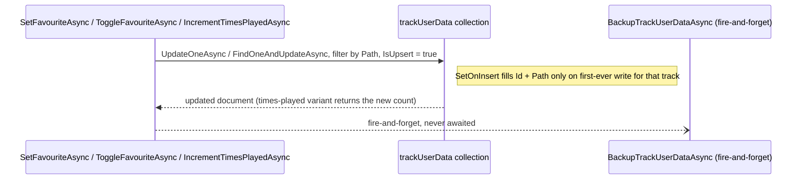

# Track user data (favourites + times played)

_Category: [Library & mapping](../../DOCUMENTATION_CHECKLIST.md) · Last verified against code: 2026-09-25_

## What it does

A single MongoDB collection, `trackUserData`, is the sole source of truth for two pieces of per-track state:
whether it's favourited and how many times it's been played. One document per track, keyed by `Path`.

## The old design, and why it was replaced

Before consolidation, this state lived in three places at once: embedded in `Album.Tracks[]` (patched on every
toggle via a full-document read-modify-write), separately inside a "Favourite" playlist (also read from when
computing display favourite state during a remap), and — because those two didn't always agree — the eventual
displayed value depended on which of the two sources a given read path happened to consult. This is what let a
track appear favourited in one view and not-favourited in another. `trackUserData` replaces both, single
collection, single document per track, atomic per-field updates.

## Storage shape and case-insensitive matching

`trackUserData` is created (in `MongoDbClient.EnsureCollectionsExistAsync`) with an explicit case-insensitive
collation (`new Collation("en", strength: CollationStrength.Secondary)`) — collation can only be set at
collection-creation time, not altered afterward. Windows filesystems are case-insensitive but
case-preserving, so a track's path casing could drift between when it was favourited and when it's later
re-enumerated from disk; without this collation, that drift could silently break the lookup and make a
favourite appear to reset. Every in-memory lookup dictionary built from this collection
(`LibraryManager.BuildUserDataLookup`, see [Mapping-time bulk lookups](bulk-lookups.md)) is *also* built with
`StringComparer.OrdinalIgnoreCase` — belt-and-suspenders, since a plain C# `Dictionary` doesn't inherit Mongo's
collation for free.

## Writes: atomic, upserting, backed up

- **`SetFavouriteAsync(path, isFavourite)`** — a single `UpdateOneAsync` with `IsUpsert = true`; sets
  `IsFavourite` and `UpdatedAtUtc`, and `SetOnInsert`s `Id`/`Path` only if this is the track's first-ever
  `trackUserData` write.
- **`ToggleFavouriteAsync(path)`** — reads the current value, flips it, calls `SetFavouriteAsync`. Not fully
  atomic (a read then a separate write) — accepted as a negligible race for a single-user personal app (two
  simultaneous toggles of the same track from two clients at once isn't a realistic scenario), and still a
  large improvement over the old three-way desync design.
- **`IncrementTimesPlayedAsync(path)`** — a genuinely atomic `FindOneAndUpdateAsync` using `Inc(1)`, no
  read-modify-write at all; returns the new count directly from the update result.

Every write above fires `BackupTrackUserDataAsync()` afterward, fire-and-forget — see [trackUserData
disaster-recovery backup](../07-persistence-storage/track-user-data-backup.md).

## Migration: one-time, ordered ahead of everything else

`LibraryManager.MigrateTrackUserDataIfNeededAsync()` runs once, awaited, from `MusicServer`'s startup sequence
— before anything else can read `trackUserData` — checking whether the collection is already populated
(`GetAllTrackUserDataAsync().Any()`) and doing nothing if so. If empty, it reconstructs records from whichever
source is available, preferring the disaster-recovery backup file over the old Album-embedded/Favourite-playlist
data (a full Mongo clear wipes the latter too, so they can't help recover from exactly the scenario the backup
exists for) — see [trackUserData disaster-recovery backup](../07-persistence-storage/track-user-data-backup.md)
for the fallback order. `InsertTrackUserDataBatchAsync` does a plain bulk `InsertManyAsync` (not an upsert)
since migration only ever runs against a collection already confirmed empty, and seeds the backup file
immediately afterward rather than waiting for the first real toggle/play.

## Read paths: fresh during mapping, overlaid otherwise

Any path that runs an actual mapping pass ([full scan](full-mapping-pipeline.md), [single-album
refresh](single-album-refresh.md)) reads `trackUserData` fresh via `BuildUserDataLookup` as part of that pass —
see [Mapping-time bulk lookups](bulk-lookups.md). The two read paths that *don't* run a mapping pass — the
[cache-load pass](cache-load-pass.md)'s fast library load, and `GetSelectedAlbumAsync`'s single-album JSON
read — instead call `LibraryManager.ApplyLiveTrackUserDataAsync()` right before returning, overlaying live
`IsFavourite`/`TimesPlayed` onto the otherwise-stale cached JSON. Both mechanisms end at the same collection,
so there's exactly one place this state is ever written, and two places it's read fresh vs. two places it's
overlaid — never a third independent source to drift out of sync again.

## Known constraints

- `ToggleFavouriteAsync`'s read-then-write isn't atomic — acceptable for a single-user app, would need
  revisiting for any multi-user scenario.
- The collation is fixed at collection creation; changing it later would require dropping and recreating the
  collection (with a full data migration), not just an application-level config change.
