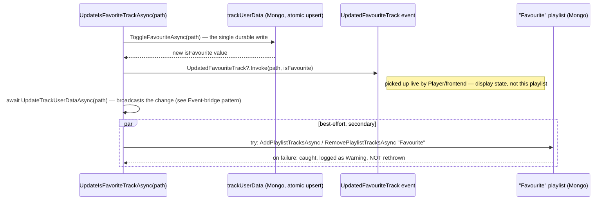

# The "Favourite" playlist's dual role

_Category: [Playlists](../../DOCUMENTATION_CHECKLIST.md) · Last verified against code: 2026-09-25_

## What it does today

"Favourite" is one of two fixed system playlists (`PlaylistManager.CORE_PLAYLISTS`, alongside the currently
inert `" Recently Played"` — see [User-created playlists](user-created-playlists.md)). It's a real, playable
playlist — "play everything I've favourited" — kept in sync automatically every time a track is
favourited/unfavourited anywhere in the app. It used to also be the thing display favourite state (the heart
icon) was computed from; it no longer is.

## Then vs. now

Before the `trackUserData` collection existed (see [Track user data](../02-library-mapping/track-user-data.md)),
toggling a favourite was a three-way, untransacted write: the `Album` document's embedded `Track.IsFavourite`
field (a full-document read-modify-write), the "Favourite" playlist's track list, and the per-album AppData JSON
cache file — three separate writes, patched by hand, with nothing tying them together. Any one of those three
could fail, or drift out of sync with the other two, which is exactly what caused favourites to silently appear
"reset" in one view while showing correctly in another.

`UpdateIsFavoriteTrackAsync(path)` now does exactly one durable write — `MongoDbClient.ToggleFavouriteAsync`
against `trackUserData`, a single atomic upsert. That's the only thing that has to succeed for the toggle
itself to be considered done. Syncing the "Favourite" playlist's track list happens afterward, in its own
nested `try`/`catch`: it's real (the playlist has to actually reflect what's favourited for "play my
favourites" to work), but explicitly secondary — a failure there is caught, logged as a Warning, and does not
propagate. The playlist can lag behind by one toggle in a failure case; it can no longer corrupt what the
heart icon displays anywhere, because nothing reads display state from this playlist anymore.

## What changed, concretely

- **Display favourite state** (the heart icon on any track, anywhere) is computed from `trackUserData` only —
  see [Track user data](../02-library-mapping/track-user-data.md)'s read paths (fresh during a mapping pass, or
  the `ApplyLiveTrackUserDataAsync` overlay on cache reads).
- **The "Favourite" playlist** is still maintained, but purely as a real playable playlist — its own `Tracks[]`
  list in the Mongo `playlists` collection, kept approximately in sync by the best-effort block above.
- If the two ever disagree (the playlist lagging after a sync failure), the heart icon is still correct — only
  the *contents of the Favourite playlist itself* would be briefly stale until the next successful toggle.

## Known constraints

- The best-effort sync means the "Favourite" playlist's track list is not guaranteed consistent with
  `trackUserData` at every instant — only eventually, assuming subsequent toggles succeed. There's no
  reconciliation pass that would catch a permanently stuck desync (e.g. a toggle that always fails for one
  specific track).
- `GetTrackInformation(path)` is called inside the sync block to build the `PlaylistTrack` object added/removed
  from the playlist — this re-reads the file's tags/image from disk on every single toggle rather than reusing
  anything already in memory, since the favourite toggle can be triggered from a context (the library grid, a
  playlist view) that doesn't necessarily have a fully-populated `PlaylistTrack` on hand already.
