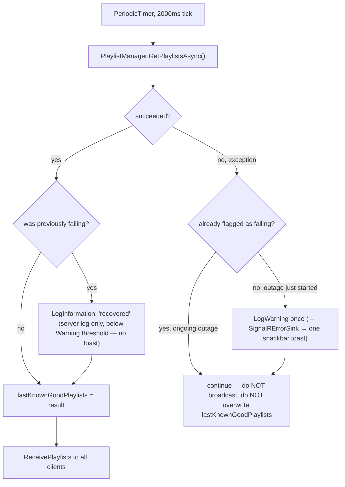

# Playlist real-time sync

_Category: [Playlists](../../DOCUMENTATION_CHECKLIST.md) · Last verified against code: 2026-09-25_

## What it does

`MusicServer/Startup/PlaylistBroadcast.cs` polls the current playlist set every 2 seconds while playback is
active and pushes it to every connected client — the mechanism behind "Now Playing," "Favourite," and (once
implemented) any user-created playlist staying live across multiple open clients without a manual refresh.

## Started/stopped by `PlaylistHub`, not self-contained

Unlike [`AudioOutputAvailabilityBroadcast`](../01-playback-engine/audio-output-switching.md#automatic-monitoring-audiooutputavailabilitybroadcast)
(always-on regardless of playback state), this loop is explicitly started and stopped — `PlaylistHub.StartPlayingUpdatesAsync()`/
`StopPlayingUpdatesAsync()` call `PlaylistBroadcast.Start()`/`Stop()` directly. `PlaylistHub` already lives in
`MusicServer`, so unlike the playback broadcast loop (which needed an event bridge from `MusicPlayer`, since
`Player` lives in a different project — see [Event-bridge pattern](../05-realtime-sync/event-bridge-pattern.md)),
there was never a cross-project reason for indirection here; the old design routed this through a self-HTTP-POST
via `ServerHttpClient`/`BroadcastController` anyway, pure unnecessary overhead, since removed.

## The loop: last-known-good on failure, edge-triggered logging

Two deliberate design choices, both fixes for real observed problems:

- **Edge-triggered failure logging.** A transient Mongo outage (the incident that prompted this — a genuine
  `MongoConnectionException`/socket timeout lasting 30+ seconds, not an app bug) used to log (and therefore
  toast, via `SignalRErrorSink` forwarding Warning+ logs — see [SignalRErrorSink](../05-realtime-sync/signalr-error-sink.md))
  a fresh "Unable to load playlists" warning on *every single failed tick* for the outage's entire duration —
  dozens of near-identical toasts stacking up for what was really one ongoing problem. `isCurrentlyFailing`
  tracks the state across ticks so only the transition (healthy→failing, and failing→healthy) is logged, not
  every tick in between.
- **Last-known-good on failure, no broadcast.** The old code's `finally` block always broadcast, even on
  failure — sending an empty list to every client the moment one fetch failed, wiping out whatever playlists
  were already correctly displayed. Now a failed fetch is skipped entirely (`continue`, no broadcast at all),
  leaving every client showing the last successfully fetched data until a subsequent tick actually succeeds.

## The removed dead Redis-merge path

An earlier version of this loop also attempted to merge in a `"Playlists"` key from Redis on every tick.
Investigating a related noisy-toast complaint found that **nothing in the entire codebase ever wrote that key**
— `RedisCache.GetAsync("Playlists")` was throwing "key does not exist" on every single 2-second tick,
permanently, not reporting an intermittent real outage. That produced the same stacking-toast symptom as the
edge-triggered fix above was later built to solve, except for a condition that could never actually recover.
Confirmed by grepping every `RedisCache.SetAsync` call site in the app: only `"scrollProsition"` and
`"SelectedAlbum"` are ever written (see [Storage map](../07-persistence-storage/storage-map.md)). Removed
entirely rather than merely silenced — caching the full playlist JSON payload in Redis on every read would be a
meaningful amount of data to push through it regardless, so Mongo-only was judged the right shape here, not a
fallback path worth keeping around. The identical dead attempt in `PlaylistHub.GetPlaylistsAsync()` (behind a
hardcoded `throw new Exception();` that unconditionally skipped it — itself dead code disabling dead code) was
removed in the same pass. Full history in `KNOWN_ISSUES.md` #2/#3.

## Known constraints

- The 2-second interval matches other broadcast loops' cadence (see [Broadcast loop
  pattern](../05-realtime-sync/broadcast-loop-pattern.md)) — not configurable per-deployment.
- A client that connects mid-outage (after `lastKnownGoodPlaylists` was last populated but before recovery)
  sees whatever was last known good, which could be arbitrarily stale for the duration of a long outage — there
  is no separate "data may be stale" indicator sent to the client.
