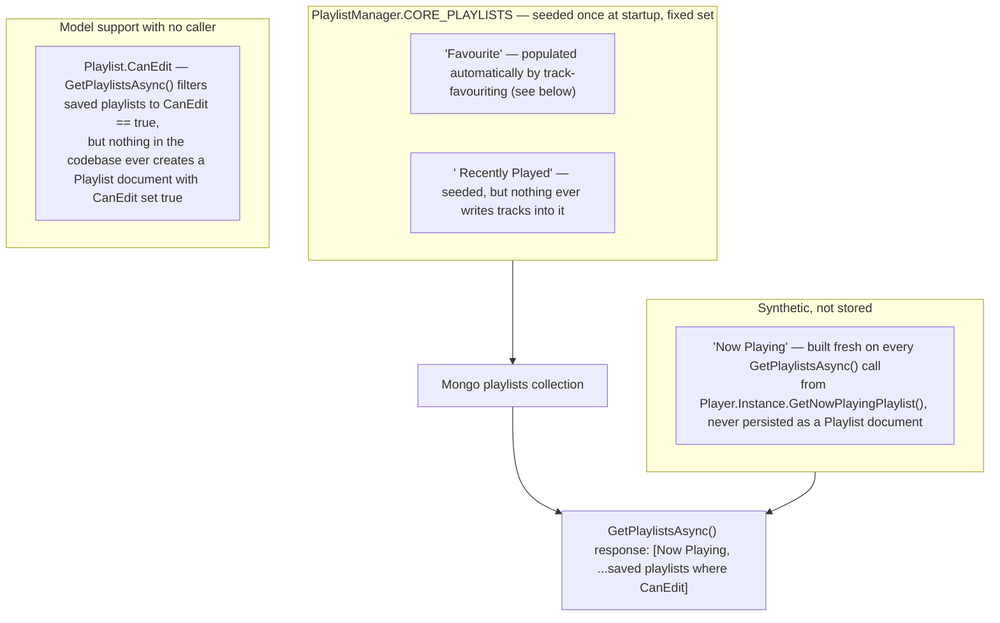

# User-created playlists

_Category: [Playlists](../../DOCUMENTATION_CHECKLIST.md) · Last verified against code: 2026-09-25_

## What actually exists today

The checklist bullet this doc covers names "create/rename/delete, add/remove tracks" for user-created
playlists. Tracing the actual code path: **this feature isn't implemented yet.** What exists is the
infrastructure it would need, plus two fixed system playlists that don't go through it.

## What's really there

`PlaylistManager.GetPlaylistsAsync()` returns the live "Now Playing" pseudo-playlist plus whatever's in the
Mongo `playlists` collection with `CanEdit == true`. `InitializePlaylistsAsync()` (run once from the singleton
constructor, fire-and-forget) seeds exactly two named entries if they don't already exist —
`CORE_PLAYLISTS = ["Favourite", " Recently Played"]` (note the leading space in the second name, present in the
actual constant) — both inserted via `MongoDbClient.InsertPlaylistAsync(new Playlist { Name = name, Tracks =
[] })`, which leaves `CanEdit` at its default (`false`). So neither core playlist is ever returned by
`GetPlaylistsAsync()`'s general list either — "Favourite" is surfaced to the UI through a completely separate
path (see [Favourite playlist dual role](favourite-playlist.md)), and " Recently Played" isn't surfaced or
populated by anything in the current codebase at all.

`PlaylistHub` (the SignalR hub a frontend would call into) exposes exactly three methods:
`GetPlaylistsAsync()`, `StartPlayingUpdatesAsync()`/`StopPlayingUpdatesAsync()` (controls [Playlist real-time
sync](playlist-broadcast.md)) — no create, rename, delete, or add/remove-tracks endpoint exists on it.
`MongoDbClient` does have the underlying primitives (`InsertPlaylistAsync`, `UpdatePlaylistAsync`,
`AddPlaylistTracksAsync`, `RemovePlaylistTracksAsync`) — but grepping every call site shows `AddPlaylistTracksAsync`/
`RemovePlaylistTracksAsync` are only ever invoked for the hardcoded name `"Favourite"`, from
`LibraryManager`'s favourite-toggle path, never from any generic playlist-editing flow. The frontend's
`Playlist` model/interface carries a `canEdit` field, but nothing in the Angular app reads or acts on it either
— no create/rename/delete UI exists.

## What this means for the checklist

Rather than document a create/rename/delete/add/remove flow that doesn't exist, this doc records the actual
state: the data model (`Playlist.CanEdit`) and storage primitives are in place, but the feature that would use
them — letting the user make and manage their own named playlists — hasn't been built. If it is built later,
the natural shape (based on what's already there) would be: new `PlaylistHub` methods for create/rename/delete
and add/remove-tracks, setting `CanEdit = true` on insert so `GetPlaylistsAsync()`'s existing filter picks them
up automatically, and reusing `MongoDbClient.AddPlaylistTracksAsync`/`RemovePlaylistTracksAsync` generically
instead of hardcoding `"Favourite"` as the only caller.

## Known constraints

- " Recently Played" is seeded as a `CORE_PLAYLISTS` entry but is entirely inert — no code path adds tracks to
  it, removes from it, or surfaces it to the frontend. Either dead scaffolding for a feature that was never
  finished, or a placeholder for one planned later.
- The leading space in `" Recently Played"` (present in the actual source constant) would need cleaning up
  before that playlist is ever surfaced anywhere user-facing.
