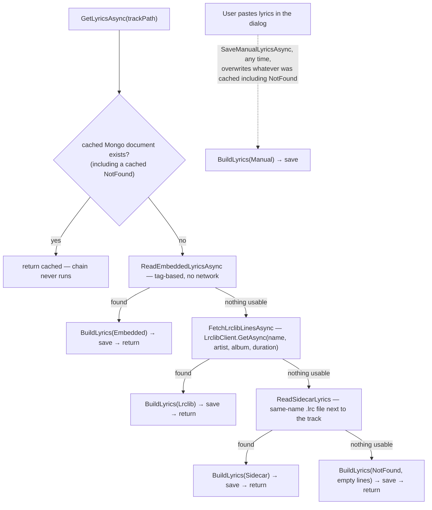

# Lyrics source chain

_Category: [Lyrics](../../DOCUMENTATION_CHECKLIST.md) · Last verified against code: 2026-09-25_

## What it does

`LyricsManager.GetLyricsAsync(trackPath)` resolves lyrics for a track by trying four sources in order, caching
whichever one succeeds (or a `NotFound` if none do) so the same track never re-triggers the chain again.

## The chain

1. **Cached Mongo document** — `MongoDbClient.GetLyricsAsync(trackPath)`, a single lookup by `TrackPath`. A
   previously cached `NotFound` is itself a cache hit — the chain below never re-runs for that track unless the
   user explicitly pastes their own lyrics (see Manual, below).
2. **Embedded tag** (`ReadEmbeddedLyricsAsync`) — checked first specifically because it's free (no network
   call) whenever present. Format-dependent: MP3 can carry real per-line timing via the ID3v2 `SYLT` frame
   (only `Milliseconds`-format timestamps are used directly — `MpegFrames`-format would need the exact frame
   rate the original encoder used, which isn't reliably recoverable after the fact, and `Milliseconds` is what
   virtually every modern tagger writes anyway); FLAC and M4A/MP4 can only ever surface plain unsynced text this
   way (no synced-lyrics convention exists for Vorbis comments or MP4 atoms in the tagging library used).
   Every other supported format (WAV, AIFF, Ogg Vorbis/Opus, WavPack, etc.) has no meaningful embedded-lyrics
   convention and isn't given a dedicated branch — LRCLIB and the sidecar are still tried for these regardless.
3. **LRCLIB** (`FetchLrclibLinesAsync`) — a network call to the LRCLIB free lyrics API, matched by track
   name/artist/album/duration (pulled via `LibraryManager.GetTrackInformation`). Prefers `SyncedLyrics` when
   LRCLIB has it; falls back to `PlainLyrics` (still worth taking over nothing) when only that's available.
4. **`.lrc` sidecar file** (`ReadSidecarLyrics`) — a same-name `.lrc` file next to the track (`Song.flac` →
   `Song.lrc`), the standard convention every LRC-aware player/tagger already follows — picks up lyrics left
   over from another player, or placed there manually outside the app, with no extra work.
5. **`NotFound`** — cached explicitly (not left as a missing document) once all three automated sources come up
   empty, so the user sees "no lyrics found" with the option to paste their own, and doesn't re-trigger the
   same (potentially slow, potentially network-dependent) chain every time they reopen the dialog for that
   track.

A failure anywhere in the chain (a corrupt tag, an unreachable LRCLIB, a permissions error reading the sidecar
file) is caught at the top level and also resolves to a cached `NotFound` — errors never propagate out to the
hub as a thrown exception; the user experience is identical to "genuinely no lyrics available."

## Manual paste: the escape hatch

`SaveManualLyricsAsync(trackPath, rawText)` is a separate entry point from the dialog's paste box, usable any
time — including to overwrite a prior `NotFound`, or to replace an automated result the user judges wrong or
incomplete (the user pasting something in is treated as a stronger signal than whatever was cached before). It
routes both a real `.lrc`-formatted paste and plain unformatted text through the same `LrcParser.Parse` entry
point used everywhere else in the chain, so the manual path doesn't need to know which kind of text it
received. It reuses the existing cached document's `Id` when one exists (Mongo rejects a replace that changes
an existing document's immutable `_id`), rather than generating a fresh one the way every automated `BuildLyrics`
call does (safe there, since those only ever run on a genuine cache miss with no existing document to collide
with).

## Known constraints

- The chain order is fixed — there's no per-track or per-user preference for, say, always preferring LRCLIB
  over an embedded tag even when both exist; embedded always wins if present.
- LRCLIB matching is by metadata (name/artist/album/duration), not an audio fingerprint — a mistagged or
  unusually-named track can miss a real match that exists on the service.
