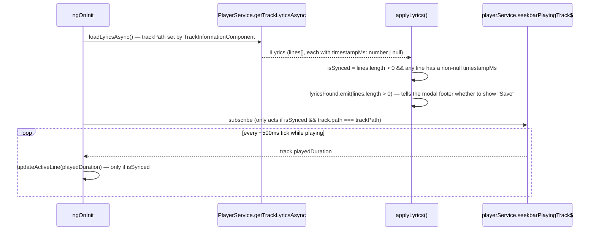

# Synced lyrics display and line-highlighting

_Category: [Lyrics](../../DOCUMENTATION_CHECKLIST.md) · Last verified against code: 2026-09-25_

## What it does

`LyricsComponent` (opened from the track-information dialog) shows the resolved lyrics for the currently
playing track, Apple Music-style — the current line highlighted and auto-scrolled into view as playback
progresses, when timing data is available; a plain static block of text when it isn't; and a manual paste box
when nothing was found at all.

## Loading and mode detection

`isSynced` is derived, not a separate flag from the backend — `lines.some(line => line.timestampMs !== null)`.
A track resolved from an embedded FLAC/M4A tag or LRCLIB's plain-text fallback (see [Lyrics source
chain](lyrics-source-chain.md)) has every line's `timestampMs` as `null`, so `isSynced` is `false` and the
component renders a static block instead of attempting to highlight anything.

## Line-highlighting: reusing the existing seekbar tick, not a new timer

The synced view doesn't run its own polling loop — it subscribes to `playerService.seekbarPlayingTrack$`, the
same ~500ms-ticking observable the [player's read-only seekbar display](../01-playback-engine/transport-controls.md#no-seek-method)
already exposes (driven by `PlaybackBroadcast`'s tick — see [Playback tick bandwidth
fix](../05-realtime-sync/playback-tick-bandwidth-fix.md)). Reusing it means no second source of playback
position exists to potentially disagree with the first, and the subscription is guarded to the track this
dialog was opened for (`track.path !== this.trackPath` is a no-op), so nothing happens if playback somehow
moves to a different track while the dialog is still open.

`updateActiveLine(playedDurationSeconds)` converts to milliseconds and does a full forward scan from the start
of `lines` every single tick, rather than only ever advancing an index forward — lines are already time-ordered
by `LrcParser`, so a simple linear scan is enough, and re-scanning from the start every time means a manual
seek/rewind (jumping backward) is handled correctly for free, without any special-cased "did we just seek
backward" logic. The scan finds the *last* line whose timestamp hasn't been reached yet; if that index hasn't
changed since the previous tick, nothing re-renders or re-scrolls.

## The known ~1s lag

Both the highlight and the underlying position it's driven from update only as often as `seekbarPlayingTrack$`
ticks — approximately every 500ms, sourced from `PlaybackBroadcast`'s own 500ms `PeriodicTimer`. In the worst
case (a line boundary falling right after a tick was just processed), the highlight can lag the actual audio by
close to a full tick interval before the next update catches it up — visually closer to ~1 second of drift in
practice than a frame-accurate karaoke-style display would show. This is an accepted trade-off of reusing the
existing broadcast tick rather than adding a dedicated, more frequent client-side timer purely for lyrics.

## Manual paste fallback

Shown only once loading has finished and `hasNoLyrics` is true (`!isLoading && lines.length === 0`) —
`onSaveManualLyricsClicked` calls `PlayerService.saveManualLyricsAsync`, then re-applies the result through the
same `applyLyrics()` path used for the initial load, so a successful manual save transitions the view straight
from "paste box" to "displaying lyrics" (synced or not, depending on whether the pasted text was itself
LRC-formatted) without a separate reload.

## Known constraints

- No frame-accurate mode exists or is planned — the ~1s lag is a known, accepted characteristic tied to reusing
  the existing tick rather than a bug being tracked for a fix.
- `scrollActiveLineIntoView` defers via `setTimeout(…, 0)` so the DOM reflects the newly active line's CSS class
  (and therefore correct `scrollHeight`) before `scrollIntoView` measures anything — a same-tick call would
  measure against the *previous* line's layout.
