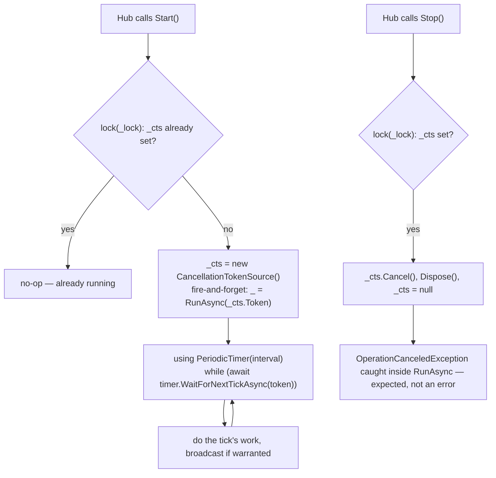

# The broadcast loop pattern

_Category: [Real-time sync / broadcast architecture](../../DOCUMENTATION_CHECKLIST.md) · Last verified against code: 2026-09-25_

## What it does

Every `MusicServer/Startup/*Broadcast.cs` class — `PlaybackBroadcast`, `PlaylistBroadcast`,
`AudioOutputAvailabilityBroadcast`, `ServerStatusBroadcast`, `MappingUpdateBroadcast`,
`TrackUserDataBroadcast` — shares one of two shapes: a start/stoppable `PeriodicTimer` polling loop, or a
handler subscribed once to a plain C# event. Both replaced an older design (`BroadcastController`) that ran
unconditional timers regardless of whether anything was actually listening or had actually changed.

## Shape 1: the `PeriodicTimer` loop (`Playback`, `Playlist`, `AudioOutputAvailability`, `ServerStatus`)

Every loop in this shape follows the identical skeleton: a private static `CancellationTokenSource _cts`
guarded by a private static `lock` object, `Start()`/`Stop()` that no-op if already in the requested state, and
`RunAsync` wrapped in a `try`/`catch (OperationCanceledException)` that treats cancellation as expected (fired
by `Stop()` mid-tick) rather than a real failure. Intervals vary by how time-sensitive each is: `PlaybackBroadcast`
500ms (drives the seekbar and [synced lyrics highlighting](../04-lyrics/synced-lyrics-display.md)),
`PlaylistBroadcast`/`AudioOutputAvailabilityBroadcast` 2000ms, `ServerStatusBroadcast` 5000ms (just a version
string, nothing time-sensitive about it).

**Started/stopped by whichever hub owns the concern**, not always running: `PlayerHub.PlayAsync` starts
`PlaybackBroadcast`; `Player.PlaybackBroadcastStopRequested` (an event, not a direct call — see [Event-bridge
pattern](event-bridge-pattern.md)) stops it once a playlist ends. `PlaylistHub`/`ServerHub` start/stop their own
loops via explicit `Start*Async`/`Stop*Async` hub methods the frontend calls on connect/disconnect.
`AudioOutputAvailabilityBroadcast` is the one exception — started once from `PlayerHub.InitializePlayerAsync`
and never stopped for the life of the connection, since output availability can change whether or not anything
is playing (see [Audio output switching](../01-playback-engine/audio-output-switching.md)).

**Edge-triggered broadcasting**, not "send every tick regardless": `PlaylistBroadcast` skips broadcasting
entirely on a failed fetch rather than pushing an empty list (see [Playlist real-time
sync](../03-playlists/playlist-broadcast.md)); `AudioOutputAvailabilityBroadcast` only broadcasts when
availability actually changed or a fallback just happened. This "only send when something's different" rule —
and the closely related "only log a transition, not every tick" rule for failure states — is the direct fix for
`KNOWN_ISSUES.md` #2: the old unconditional-broadcast design produced both excess bandwidth (playback ticks with
full track objects and base64 art on every single 500ms/2000ms tick, sent over Tailscale) and, separately, a
warning log (and therefore a client-facing snackbar toast, see [SignalRErrorSink](signalr-error-sink.md)) on
*every* tick of an ongoing failure rather than once when it started.

## Shape 2: event-driven (`MappingUpdateBroadcast`, `TrackUserDataBroadcast`)

No timer at all — `MappingUpdateBroadcast` subscribes once, at startup, to `LibraryManager.Instance.MappingUpdate.Changed`
(a plain C# event raised by every property setter on `MappingUpdate` — see [Mapping
statistics/history](../02-library-mapping/mapping-statistics.md)); `TrackUserDataBroadcast` subscribes to
`LibraryManager.TrackUserDataChanged`. Each mutation anywhere in the system fires the handler directly — no
polling interval to tune, no risk of a change sitting unbroadcast until the next tick, and no wasted ticks when
nothing has changed between polls. This shape is only viable because the underlying source (`MappingUpdate`,
`LibraryManager`) already lives in the same process and can raise a plain event — see [Event-bridge
pattern](event-bridge-pattern.md) for why that's true despite `MusicPlayer` and `MusicServer` being separate
projects.

## Why not just always broadcast unconditionally (the old design)

The original `BroadcastController` ran fixed timers (500ms/2000ms/1ms/5000ms in various regions) unconditionally,
regardless of whether any client was even connected or whether the underlying data had changed since the last
tick — see `KNOWN_ISSUES.md` #2 for the full incident history, including a genuinely pathological case where a
permanently-failing Redis lookup (nothing ever wrote the key it was checking) produced a fresh warning-level
toast every single tick, forever (`KNOWN_ISSUES.md` #2/#3, also covered in [Playlist real-time
sync](../03-playlists/playlist-broadcast.md)'s dead-Redis-merge section). The current pattern's two safeguards —
edge-triggered broadcasting and edge-triggered failure logging — are both direct responses to that incident, not
just a generic "best practice" applied preemptively.

## Known constraints

- Every loop broadcasts to `Clients.All` — no per-connection targeting, consistent with [Hub
  topology](hub-topology.md)'s note that this app has no concept of multiple independent households sharing one
  server.
- The `PeriodicTimer`-based loops each maintain their own separate `_cts`/`_lock` static state — there's no
  shared base class or helper; the skeleton is duplicated across five files by convention rather than factored
  out. A new broadcast loop needs to copy the pattern by hand.
