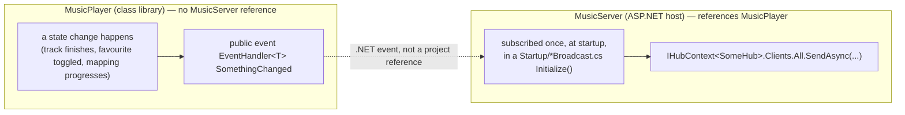

# The event-bridge pattern

_Category: [Real-time sync / broadcast architecture](../../DOCUMENTATION_CHECKLIST.md) · Last verified against code: 2026-09-25_

## What it does

`MusicPlayer` (the class library holding `Player`, `LibraryManager`, and all core state) raises plain C# events
when something happens that a client needs to know about. `MusicServer` (the ASP.NET host, which owns the
SignalR hubs and DI container) subscribes to those events exactly once, at startup, and forwards each one
straight to the relevant hub's clients. Nothing in `MusicPlayer` ever calls into SignalR, a hub, or an
`IHubContext` directly.

## Why this exists: no circular project reference

`MusicServer` references `MusicPlayer` (it needs `Player`, `LibraryManager`, etc. to build hub methods around).
`MusicPlayer` cannot reference `MusicServer` back — that would be a circular project reference, which .NET
doesn't allow. But `Player`/`LibraryManager` are exactly where the state changes worth broadcasting actually
happen (a track finishes, a favourite toggles, a mapping run progresses) — so something has to bridge from a
`MusicPlayer`-side state change to a `MusicServer`-side SignalR broadcast without an assembly reference going
the wrong way. A plain C# event, defined and raised on the `MusicPlayer` side and subscribed to from the
`MusicServer` side, does exactly that — `MusicPlayer` has no idea SignalR exists; it just raises an event the
same way any .NET event works.

## What it replaced: self-HTTP-POST loopback

Before this pattern, the same need (notify connected clients of a `MusicPlayer`-side change) was met by
`MusicPlayer` making an HTTP `POST` request to `MusicServer`'s own REST API — running in the same process,
looping back to itself over the network just to reach code that, structurally, could have called a hub
directly if not for the circular-reference constraint. `ServerHttpClient`/`MetadataController`/`LoggingController`
were the machinery behind this — all now deleted entirely. This wasn't just inefficient; it was a real source
of bugs: any transient failure in that loopback (or in reasoning about ordering between it and a hub's own
direct broadcasts) could silently drop a client-facing update, and dedicated HTTP-round-trip machinery for a
same-process notification only added surface area no `EventHandler` field wouldn't have covered anyway.

## The three bridges in this codebase

- **`MappingUpdate.Changed`** — every property setter on `MappingUpdate` raises `Changed`. `MappingUpdateBroadcast.Initialize`
  subscribes once, forwarding to `LibraryHub` clients and (on `IsComplete`) also persisting a `MappingStatistic`.
  See [Mapping statistics/history](../02-library-mapping/mapping-statistics.md).
- **`Player.PlaybackBroadcastStopRequested`** — raised by `Player.HandleReachedEndOfPlaylist` when a playlist
  genuinely ends. `PlaybackBroadcast.Initialize` subscribes once and calls its own `Stop()` — this is how the
  500ms playback tick loop stops itself without `Player` needing to know `PlaybackBroadcast` exists at all.
- **`LibraryManager.TrackUserDataChanged`** — raised by `UpdateTrackUserDataAsync` whenever a favourite toggles
  or a play count increments. `TrackUserDataBroadcast.Initialize` subscribes once and fans the same event out
  to **three** different hubs' clients (`LibraryHub`, `PlayerHub`, `PlaylistHub` — see [Hub
  topology](hub-topology.md)) in one handler, since favourite/play-count state is relevant to all three views.
  This one also illustrates a real cross-boundary serialization wrinkle worth knowing: `TrackUserData.Id` is a
  MongoDB `ObjectId`, and `System.Text.Json` (used for outgoing SignalR payloads) has no built-in converter for
  it. `MusicPlayer` can't apply a `System.Text.Json`-specific `[JsonIgnore]` to the model directly (it targets
  .NET Framework 4.8 and has no reference to that assembly). The fix lives entirely on the `MusicServer` side of
  the bridge: the handler projects the event payload into an anonymous object (`Path`, `TimesPlayed`,
  `IsFavourite`, `UpdatedAtUtc` — no `Id`) before serializing, rather than serializing `data` directly. The
  frontend's `IUserTrackData` interface never reads an `id` off this broadcast anyway, so nothing is lost.

## Known constraints

- Each bridge is subscribed exactly once, at startup, for the process's lifetime — there's no unsubscribe path,
  which is fine since these are all process-lifetime singletons (`LibraryManager.Instance`, `Player.Instance`)
  with exactly one `MusicServer` process ever subscribing.
- A handler throwing is caught and logged inside the handler itself (see each `Initialize` method's own
  `try`/`catch`) — an unhandled exception inside an event handler would otherwise propagate back into whatever
  raised the event (deep inside `MusicPlayer`'s own logic), which would be a much worse failure mode than a
  logged, swallowed broadcast failure.
