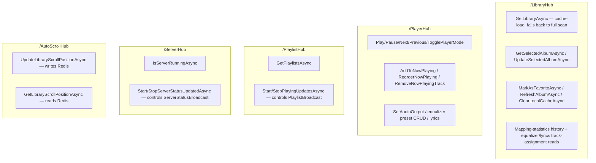

# SignalR hub topology

_Category: [Real-time sync / broadcast architecture](../../DOCUMENTATION_CHECKLIST.md) · Last verified against code: 2026-09-25_

## What it does

Five SignalR hubs, each mapped to its own endpoint in `MusicServer/Program.cs`, split the app's real-time
surface by concern. Every hub broadcasts to `Clients.All` (no per-user/per-group targeting anywhere in this
app — a personal, single-household player has no need for it), and most pair with a background `*Broadcast.cs`
loop (see [Broadcast loop pattern](broadcast-loop-pattern.md)) that does the actual periodic pushing.

## The five hubs

- **`LibraryHub`** — owns the library grid's data: the [cache-load pass](../02-library-mapping/cache-load-pass.md)
  (with full-scan fallback), the selected album detail view, favouriting, [single-album
  refresh](../02-library-mapping/single-album-refresh.md), local cache clearing, and read-only feeds for the
  Settings "Mapping Statistics" and equalizer/lyrics track-assignment lists. Paired with
  [`MappingUpdateBroadcast`](../02-library-mapping/mapping-statistics.md), which it doesn't start/stop itself —
  that loop just forwards `MappingUpdate.Changed` events whenever they fire, for the lifetime of the app.
- **`PlayerHub`** — owns the entire transport/queue/output/equalizer/lyrics surface described in [Transport
  controls](../01-playback-engine/transport-controls.md) — every STA-marshaled action that touches the live
  audio pipeline lives here. Paired with `PlaybackBroadcast`, started by `PlayAsync` and stopped via
  `Player.PlaybackBroadcastStopRequested`.
- **`PlaylistHub`** — thin: `GetPlaylistsAsync` plus start/stop for [`PlaylistBroadcast`](../03-playlists/playlist-broadcast.md).
  Genuinely all it does — playlist mutation (create/rename/delete/add-remove-tracks) doesn't exist as a feature
  yet; see [User-created playlists](../03-playlists/user-created-playlists.md).
- **`ServerHub`** — the smallest hub: a liveness check (`IsServerRunningAsync`, always returns `true` — the
  SignalR connection succeeding *is* the real signal) plus start/stop for `ServerStatusBroadcast` (CPU/RAM/uptime
  polling, unrelated to the Homepage dashboard's separate `/api/status` REST endpoint — see [Storage
  map](../07-persistence-storage/storage-map.md) and `KNOWN_ISSUES.md` #31).
- **`AutoScrollHub`** — the library grid's scroll position, persisted through Redis (`"scrollProsition"` key —
  note the typo, present in the actual code, not a documentation error) rather than through a background
  broadcast loop; both its methods read/write directly and respond inline. See [Scroll position
  persistence](../06-frontend-ui-shell/scroll-position-persistence.md).

## Who subscribes to what

The Angular frontend opens one SignalR connection per hub (five total), each wrapped by its own Angular service
(`LibraryService`, `PlayerService`, `PlaylistService`, `ServerService`, `AutoScrollService` — naming
approximate, one per hub) exposing the hub's push events as RxJS observables the rest of the app subscribes to.
Every hub broadcasts unconditionally to `Clients.All` — there's no concept of a client subscribing to a subset
of a hub's events; a connected client receives everything that hub sends, and Angular-side observables filter
or ignore what a given component doesn't need.

## Known constraints

- No group-based targeting anywhere — appropriate for a personal, single-household deployment, but would need
  rethinking (per-user groups, connection-to-user mapping) if this were ever opened up to multiple independent
  households sharing one server.
- `ServerHub.IsServerRunningAsync` is a trivial always-`true` return — its only real signal is the SignalR
  handshake succeeding at all; it doesn't check anything about server health beyond "the hub call was
  answered."
