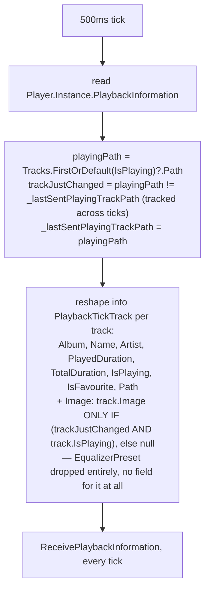

# Playback tick bandwidth fix

_Category: [Real-time sync / broadcast architecture](../../DOCUMENTATION_CHECKLIST.md) · Last verified against code: 2026-09-25_ ·
_Implemented 2026-08-18, see `KNOWN_ISSUES.md` #19_

## The problem

`PlaybackBroadcast`'s tick (see [Broadcast loop pattern](broadcast-loop-pattern.md)) runs every 500ms while
anything is playing — the fastest loop in the app, by design (it drives the seekbar and [synced lyrics
highlighting](../04-lyrics/synced-lyrics-display.md)). The original implementation serialized every track's
*full* `PlaylistTrack` object on every single tick, including its base64-encoded cover art and its full
`EqualizerPreset` object — for every track in the whole now-playing queue, not just the one currently playing.
Sent roughly twice a second, over Tailscale, this was the root cause of a real user-reported problem: the app
was noticeably impacting general internet usability while music played ("can't browse the web while music
plays" — `KNOWN_ISSUES.md` #2's original "still open" note, closed here).

## The fix: a trimmed per-tick shape, art sent only on change

`PlaybackTickTrack` is a dedicated, deliberately narrow projection type — not a reuse of `PlaylistTrack` with
some fields nulled out, but its own class with only the fields a 500ms tick actually needs. `EqualizerPreset` is
dropped from every tick unconditionally: the frontend never reads it off this payload at all (the equalizer UI
fetches presets through its own dedicated hub calls — see [Equalizer](../01-playback-engine/equalizer.md)), so
there was no reason to ever include it here. `Image` is nullable with no default, and is only populated for the
one track that `IsPlaying`, and only on the specific tick where the playing track *just changed* — every other
tick sends `Image: null` for every track, and the frontend's own carry-forward logic (`player.component.ts`)
keeps whatever image it was last given rather than re-fetching or clearing it.

## Getting there took two attempts

The first implementation added a separate `Player.CurrentTrackChanged` event with its own independent
`SendAsync` call, fired the moment `_currentProvider` changed — reusing the [event-bridge
pattern](event-bridge-pattern.md) the way `MappingUpdate.Changed`/`TrackUserDataChanged` do. User testing
caught a real regression the same day: broken album art on the first track after a server restart, which then
self-healed the moment the user skipped to the next track. Root cause: the new event-driven sender and the
existing 500ms tick's own send could both be in flight around the same moment (most likely to race exactly when
playback starts — a new tick loop and the first "track changed" event both fire together), and whichever one's
`SendAsync` happened to land last on the client overwrote the other — including a trimmed, image-less tick
landing *after* the real image-carrying one, permanently hiding the art until the next track change recovered
it by accident.

The fix was to remove the second sender entirely rather than try to order two independent senders relative to
each other: `PlaybackBroadcast.RunAsync` detects the track change itself, locally, inside its own single loop
(`_lastSentPlayingTrackPath`, compared and updated each tick) and includes the image on the one tick where it
changed. One sender per logical channel, no race possible by construction — not because the two senders were
carefully sequenced, but because there's only ever one.

**General lesson, worth remembering beyond this one bug:** don't build two independent code paths that can both
push "latest state" to the same client-side store without an explicit ordering guarantee between them — collapse
to one sender per logical channel instead of trying to win a race after the fact.

## Self-healing restart

The loop's outer `catch (Exception ex)` (distinct from the expected `OperationCanceledException` catch, which
fires on a deliberate `Stop()`) nulls `_cts` and then checks `Player.Instance.PlaybackInformation?.PlayerState?.IsPlaying`
before deciding whether to call `Start()` again — the same guard the old `BroadcastController`'s
`RestartPlaybackBroadcast()` used. A genuine mid-tick failure while still playing restarts the loop
automatically; a cancellation that happens to land in this catch block because playback already stopped
correctly does nothing, since `IsPlaying` is already `false` by then.

## Known constraints

- The bandwidth savings are specifically about *cover art and equalizer data*, not overall broadcast frequency
  — the tick itself still fires every 500ms regardless of whether anything actually changed (unlike the
  edge-triggered broadcasting other loops use, see [Broadcast loop pattern](broadcast-loop-pattern.md)). Playback
  position genuinely does change every tick while playing, so there's no meaningful "nothing changed" case to
  skip here the way there is for playlists or output availability.
- `_lastSentPlayingTrackPath` is loop-local state — a `MusicServer` restart resets it, so the very first tick
  after any restart always treats the current track as "just changed" and sends its image, even if playback had
  already been on that track for a while before the restart.
