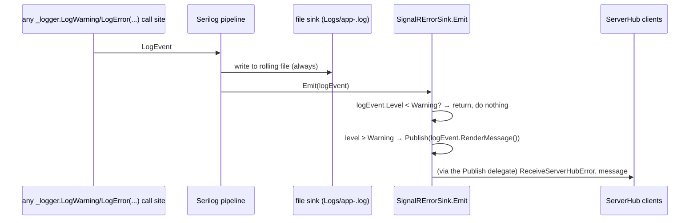

# `SignalRErrorSink`

_Category: [Real-time sync / broadcast architecture](../../DOCUMENTATION_CHECKLIST.md) · Last verified against code: 2026-09-25_

## What it does

Every `LogWarning`/`LogError` call anywhere in the app (both `MusicServer` and, via `AppLogger`'s bridge,
`MusicPlayer`) is automatically forwarded to every connected client as a live `ReceiveServerHubError` SignalR
message, which the Angular UI renders as a snackbar toast — with zero extra code at any individual call site.

## How: a custom Serilog sink, not a controller

`SignalRErrorSink` implements Serilog's `ILogEventSink` and is registered as an extra `WriteTo.Sink(...)` on the
same `LoggerConfiguration` that also writes to the rolling file log (`Logs/app-.log`) — see `Program.cs`. Every
log event Serilog processes is handed to *every* configured sink, so adding this one means every `_logger.LogX`
call in the codebase is automatically evaluated for "should this also go out live to clients," with no call
site needing to know that's happening.

This replaces `LoggingController`'s old dual job of "log this" *and* "also tell connected clients about it over
SignalR" as one controller action — splitting those into "the file sink logs" and "this sink broadcasts" is the
more idiomatic shape for Serilog, and meant `LoggingController` itself (along with `LogEntry.cs`/`Severity.cs`)
could be deleted entirely (see `KNOWN_ISSUES.md` #7).

## The bootstrap-ordering problem, and its fix

`SignalRErrorSink` is constructed as part of the *bootstrap* `Log.Logger`, configured before `CreateBuilder`
even runs (deliberately — so startup failures are caught by logging too). At that point, the ASP.NET DI
container doesn't exist yet, so there's no `IHubContext<ServerHub>` available to give the sink a way to
actually reach clients. The fix: `Publish` is a `public static Func<string, Task>` property, defaulted to a
no-op (`_ => Task.CompletedTask`) at construction time, then reassigned for real after `app.Build()` once
`IHubContext<ServerHub>` exists: `SignalRErrorSink.Publish = message =>
serverHubContext.Clients.All.SendAsync("ReceiveServerHubError", message);`. Any log event emitted *before* that
reassignment (during the earliest part of startup) is silently swallowed by the no-op default rather than
throwing — acceptable, since there are no connected clients that early anyway. This static-plus-settable
tradeoff mirrors the same pattern `MusicPlayer.Common.AppLogger` uses for the identical reason (a static bridge
needing something from the DI container that isn't ready yet when the bridge itself is first constructed).

## Warning-and-above only

`SignalRErrorSink`'s constructor takes a `minimumLevel` (`LogEventLevel.Warning`, set once in `Program.cs`);
`Emit` returns immediately for anything below it. This threshold is what makes the sink usable at all — routine
`LogInformation` calls (of which there are many, across every broadcast loop's normal-operation logging) never
reach clients, only genuinely actionable Warning/Error events do.

## The blast-radius risk: the Redis-merge incident

Because *every* Warning-or-above log event anywhere in the app becomes a client-facing toast, a single
misbehaving log call can flood every connected client with repeated near-identical notifications — this isn't
hypothetical, it already happened once. `PlaylistBroadcast`'s original design queried a `"Playlists"` Redis key
that nothing in the app ever actually wrote; the resulting "key does not exist" failure logged a Warning on
*every single 2-second tick*, forever, which `SignalRErrorSink` dutifully forwarded as a fresh snackbar every
2 seconds. See [Playlist real-time sync](playlist-broadcast.md#the-removed-dead-redis-merge-path) and
[Broadcast loop pattern](broadcast-loop-pattern.md) for the fix (edge-triggered failure logging, and removing
the dead Redis path entirely) — but the underlying lesson is specific to this sink: because it has no
rate-limiting or deduplication of its own, **every loop that logs at Warning+ is responsible for its own
edge-triggering discipline**; the sink itself will faithfully broadcast whatever it's given, as often as it's
given it.

## Known constraints

- No rate limiting, deduplication, or backoff inside the sink itself — it is a pure fan-out of whatever reaches
  it at Warning level or above. Any future code that logs a Warning/Error in a tight loop reintroduces the same
  flood risk unless it edge-triggers its own logging the way the fixed broadcast loops now do.
- `Publish`'s no-op default window (before `app.Build()` reassigns it) means genuinely early startup failures
  (e.g. a Mongo connection failure during `EnsureCollectionsExistAsync`) are captured in the file log but never
  reach any client — expected, since no client could be connected that early, but worth knowing when debugging
  a startup crash purely from client-side symptoms.
