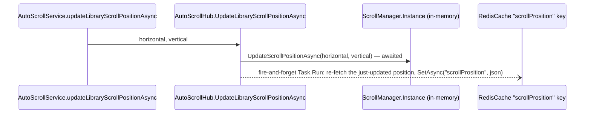
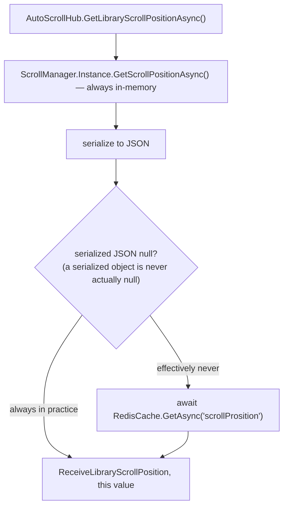

# Scroll position persistence

_Category: [Frontend UI shell](../../DOCUMENTATION_CHECKLIST.md) · Last verified against code: 2026-09-25_

## What it does

The library grid's scroll position (horizontal + vertical) survives navigating away and back — implemented as
its own small SignalR hub (`AutoScrollHub`) backed by both an in-memory value and Redis, rather than anything
client-side like `localStorage` (the frontend has no persistent client-side storage at all — see [Storage
map](../07-persistence-storage/storage-map.md)).

## Write path

`ScrollManager` (in `MusicPlayer`, a plain singleton) is the source of truth updated synchronously — a single
mutable `ScrollPosition` object with no persistence of its own, reset to `(0, 0)` on every `MusicServer`
restart. The Redis write happens afterward, fire-and-forget, purely so a fresh process (after a restart) has
something to seed from other than the in-memory default. Note the key name is `"scrollProsition"` — a typo
present in the actual source, not a documentation error; renaming it would need a coordinated change everywhere
it's read.

## Read path — and a same-session inconsistency worth knowing about

`GetLibraryScrollPositionAsync` reads from `ScrollManager` (in-memory) first, and only falls back to Redis via
`?? await RedisCache.GetAsync(...)` if the serialized JSON is `null` — but `JsonConvert.SerializeObject` on a
real (non-null) `ScrollPosition` object never actually returns `null`, it returns `"{}"` in the worst case, so
in practice the Redis fallback effectively never executes during a session where `MusicServer` hasn't restarted
— the in-memory default `(0, 0)` from a fresh `ScrollManager` always "wins" the null-coalesce, even if Redis has
a more recent real value from before a restart. Redis functions correctly as *write-time* persistence (every
update is saved there) but the read path's fallback condition doesn't actually reach it under normal
conditions — only a genuinely null/failed serialization would trigger it, which isn't the scenario Redis was
meant to recover from (a restart wiping the in-memory value). In practice this mostly self-corrects because the
frontend also calls `UpdateLibraryScrollPositionAsync` on every real scroll event, which re-populates
`ScrollManager` quickly after a restart — but the Redis fallback as written doesn't do the recovery job its
presence suggests it does.

## Frontend: `AutoScrollService`

A dedicated SignalR connection (its own hub, its own `HubConnectionBuilder`, WebSockets-only transport with
automatic reconnect) exposes `scrollPosition$` (a `BehaviorSubject`, default `(0, 0)`) for the library grid to
subscribe to, and `updateLibraryScrollPositionAsync`/`getLibraryScrollPositionAsync` to push/pull. The listener
for `ReceiveLibraryScrollPosition` includes a retry mechanism: a JSON parse failure increments a `retryCount`,
and after more than 3 failures, switches to `setInterval(..., 0)` — repeatedly re-requesting on every possible
tick — rather than giving up. This is a fairly aggressive retry (interval `0` fires essentially as fast as the
JS event loop allows) for what's meant to recover from repeated parse failures, not a normal transient error.

## Known constraints

- The Redis-fallback condition on the read path (`?? RedisCache.GetAsync(...)`) is effectively dead in the
  common case, as described above — Redis is written to correctly but not meaningfully read back from during
  normal operation, only in an edge case that's unlikely to be the one that actually needs recovering from.
- The `setInterval(..., 0)` retry-storm fallback after 3 failed parses has no upper bound or backoff — if the
  underlying cause of repeated parse failures doesn't resolve itself, this would spin indefinitely at a very
  high request rate.
- `"scrollProsition"` is a Redis key name typo baked into the running system; fixing it requires touching every
  read/write site (`AutoScrollHub`, `MongoDbClient`/`RedisCache` callers) in the same change.
