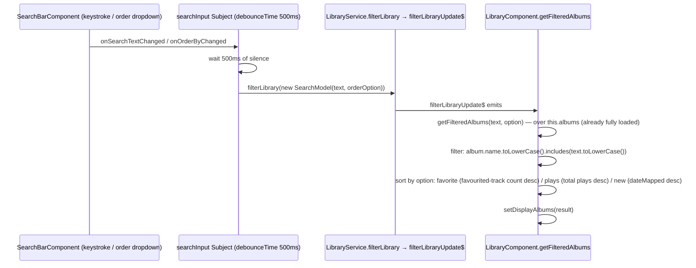

# Search (library grid + in-album track filtering)

_Category: [Frontend UI shell](../../DOCUMENTATION_CHECKLIST.md) · Last verified against code: 2026-09-25_

## What it does

Two independent, purely client-side search/filter implementations — one for the library grid (name search +
sort-order), one for filtering tracks within an open album — neither of which makes a network call. Both filter
an array the frontend already has loaded in memory.

## Library grid: `SearchBarComponent` → `LibraryService.filterLibrary` → `LibraryComponent`

`SearchBarComponent` debounces keystrokes 500ms before pushing a `SearchModel` (search text + optional
`OrderByOption`) through `LibraryService.filterLibrary` — a plain RxJS `Subject` relay, not a network call;
`LibraryService` itself never touches SignalR for this, it just re-emits the model on `filterLibraryUpdate$` for
`LibraryComponent` to react to. `getFilteredAlbums` runs entirely against `this.albums` — the full array already
loaded via the [cache-load pass](../02-library-mapping/cache-load-pass.md)/library hub — filtering by a
case-insensitive substring match on album name, then sorting by whichever `OrderByOption` is active
(`favorite`: most favourited tracks first; `plays`: highest total plays first, via
`getAlbumTrackTimesPlayed`; `new`: most recently mapped first, via `dateMapped`).

`onClearClicked` deliberately bypasses the debounced `searchInput` Subject and calls `filterLibrary` directly —
clearing is a single deliberate action, not a stream of keystrokes, so routing it through the same 500ms
debounce as typing would make the album list wait a needless half-second to reset after a single click.

## In-album track filtering: `AlbumSearchBarComponent`

A separate, simpler component used inside an open album's track list — `@Output() searchTextOutput` emits the
debounced (200ms, faster than the library grid's 500ms since there's no sort-order complexity to wait for) text
directly to the parent `AlbumComponent`, which filters its own already-loaded track list client-side (not shown
here in detail — the mechanism is the same shape as the library grid's, one level down). No `OrderByOption`
equivalent exists for in-album filtering — text search only.

## Why both are pure client-side

Both the full album list and a selected album's track list are already fully present in the frontend's memory
by the time a search box is usable — there's no reason to round-trip to the backend for a text filter over data
already sitting in an Angular component's own array. This also means search has zero dependency on connection
latency or backend load; typing filters instantly against local memory (once past each component's own
debounce).

## Known constraints

- Search is name/text-only for both — no filtering by artist, genre, or any other field on the library grid;
  the library search only matches against `album.name`.
- Sort order (`OrderByOption`) is a library-grid-only concept; the in-album track filter has no equivalent
  sort/reorder behavior, purely a text match.
- Because everything is client-side, there's no server-side search index of any kind — this only scales as well
  as "however many albums fit comfortably in a JS array and get `.filter()`ed on every debounce tick," fine at
  this app's real scale (a personal library) but not designed for a dramatically larger catalog.
