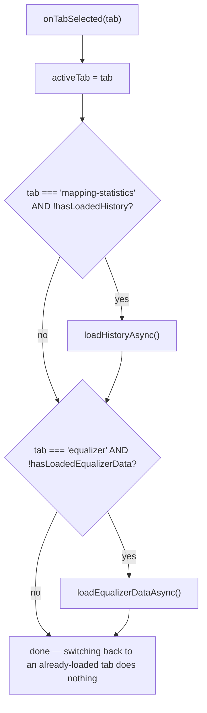

# Settings page structure

_Category: [Frontend UI shell](../../DOCUMENTATION_CHECKLIST.md) · Last verified against code: 2026-09-25_

## What it does

`SettingsComponent` hosts three tabs — General, Equalizer, Mapping Statistics — with the latter two lazy-loading
their data only the first time they're actually selected, not on page load.

## Lazy-load-once-per-tab

Each tab's data-loading method sets its own `hasLoaded*` flag to `true` only on success — switching to a tab,
away, and back again does not re-fetch, keeping repeated tab switches instant after the first visit. A mutation
inside a tab (creating/editing/deleting an equalizer preset) explicitly calls `loadEqualizerDataAsync()` again
afterward to refresh — the lazy-load guard only prevents *redundant* loads, not legitimate refreshes after a
change.

## Mapping Statistics tab: split by run type, one chart each

`loadHistoryAsync` fetches the full run history (`LibraryService.getMappingHistoryAsync()` — see [Mapping
statistics/history](../02-library-mapping/mapping-statistics.md)) once, then splits it client-side into
`cacheLoadRuns`/`fullMappingRuns` by `runType` (mirroring the backend's `MappingRunType` enum — `0 = FullScan, 1
= Cache`, a manually-kept-in-sync mirroring, same caveat as the audio-output enum in [Sidebar
navigation](sidebar-navigation.md)). The split happens once per load rather than being filtered inline in the
template, specifically to avoid re-filtering the whole list on every Angular change-detection pass for what's
otherwise a static split until the next load.

Each run-type gets its own bar chart (`cacheLoadChartData`/`fullMappingChartData`, via `ng2-charts`) — one bar
per run, x-axis the run's start time, y-axis its duration in seconds. This replaced an earlier single shared
line chart that plotted CPU/memory samples *within* one selected run rather than a trend *across* runs;
duration was chosen as the one number meaningful to compare run-over-run, since directory/byte counts vary by
how much actually changed on disk between runs, not by how efficiently the run itself performed.
`getMappingHistoryAsync` returns newest-first (matching `MongoDbClient.GetMappingStatisticsAsync`'s
`SortByDescending`); `buildDurationChartData` reverses this before charting so the bar chart reads
left-to-right oldest-to-newest (matching every other time-series chart in the app), while the accompanying
tables keep the original newest-first order — the two views deliberately use different orderings for what
reads naturally in each context.

## Equalizer tab: presets and per-track assignments share one dialog

The "Presets" and "Track Presets" sections both open the *same* `EqualizerComponent` the player's own equalizer
icon opens (see [Equalizer](../01-playback-engine/equalizer.md)) — via `ModalService.projectComponent`, the
same [modal system](modal-system.md) mechanism any dialog uses — just configured differently: `mode` set to
`'named-preset'` or `'track-preset'`, `showBypass`/`showPresetSelector` both forced `false` (neither the bypass
toggle nor the preset picker makes sense when the dialog is already editing one specific, already-chosen
preset), and the dialog title always literally `"Equalizer"` regardless of mode — the preset or track name is
shown inside the dialog body instead. `presetSaved` is subscribed to trigger `loadEqualizerDataAsync()` again,
so a save inside the shared dialog refreshes the Settings tab's own lists without the tab needing to poll or
the dialog needing any Settings-specific knowledge.

`GetTrackEqualizerAssignmentsAsync`'s response (see [Mapping-time bulk
lookups](../02-library-mapping/bulk-lookups.md#equalizer-assignments)) deliberately carries only each
assignment's preset `Guid`, not its full band data — `onEditTrackPresetClicked` fetches the full preset
on-demand, only once the user actually opens it for editing, rather than the initial tab load carrying every
assigned track's full 9-band data up front.

## Known constraints

- The lazy-load flags (`hasLoadedHistory`/`hasLoadedEqualizerData`) are purely in-component state — reopening
  the Settings page from scratch (navigating away and back) resets them, so the "load once" behavior is scoped
  to a single mount of `SettingsComponent`, not the whole session.
- `onNewPresetClicked` uses a native `window.prompt()` for the new preset's name — the one place in Settings
  that doesn't go through the [modal system](modal-system.md)'s own styled dialogs, unlike `confirm()`'s
  replacement of `window.confirm` elsewhere in the app.
