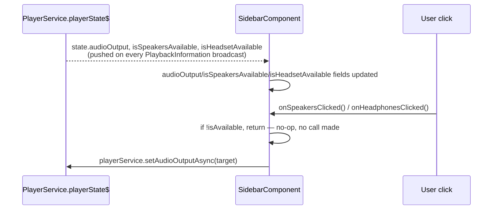

# Sidebar navigation + audio-output toggle

_Category: [Frontend UI shell](../../DOCUMENTATION_CHECKLIST.md) · Last verified against code: 2026-09-25_

## What it does

`SidebarComponent` is the app's persistent left-hand navigation (Library / Playlists / Settings), and also
hosts the embedded mini-player (`<app-player>`), the Speakers/Headset output toggle with live availability
grey-out, and power/restart controls for the backend server itself.

## Navigation

A plain static `items` array (`routeLink`/`icon`/`label`) rendered via `RouterModule` — Library, Playlists,
Settings. Nothing dynamic about the route list itself; `activeLink` tracking is handled by Angular's router
directives in the template, not custom logic in the component.

## Audio output toggle: live-driven grey-out

`audioOutput` is a plain number mirroring the backend's `AudioOutput` enum (`0 = Speakers, 1 = Headset` — the
mirroring is manual; the frontend constants `AUDIO_OUTPUT_SPEAKERS`/`AUDIO_OUTPUT_HEADSET` have to be kept in
sync with the backend enum by hand, there's no shared/generated type between the two projects). Both
availability flags default to `true` before the first `playerState$` snapshot arrives specifically so neither
icon renders as greyed out during the brief window before the first real state is known — see [Audio output
switching](../01-playback-engine/audio-output-switching.md) for where `IsSpeakersAvailable`/`IsHeadsetAvailable`
originate on the backend (`AudioOutputAvailabilityBroadcast`'s polling). A click on an unavailable output is a
pure client-side no-op (`if (!this.isSpeakersAvailable) return;`) — the backend's own `SetAudioOutput` would
also just no-op on an already-active output, but the frontend guard means an unavailable target's hub call is
never even attempted.

## Server power/restart: plain HTTP, not SignalR

Unlike everything else in the sidebar (and unlike almost everything else in the frontend), `onPowerToggled`/
`onRestartClicked` make plain `HttpClient.post` calls to fixed URLs from `environment.ts`
(`stopServerUrl`/`startServerUrl`/`restartServerUrl`) rather than going through any SignalR hub — these target
the out-of-band remote start/stop mechanism described in [Remote start/stop/restart
mechanism](../08-deployment/remote-control-mechanism.md), not `MusicServer` itself (a server that's stopped has
no SignalR hub to call). After a successful start action, the component waits a fixed 3 seconds
(`setTimeout`) before attempting `serverService.startConnectionAsync()` — a fixed guess at how long the backend
process needs to come up and start accepting SignalR connections, not a poll/retry loop.

`isServerRunning` (driving whether the power button's action is "start" or "stop") is set from
`serverService.isServerRunningAsync()` — see [SignalR hub topology](../05-realtime-sync/hub-topology.md)'s note
that `ServerHub.IsServerRunningAsync` is a trivial always-`true` return; the real signal here is whether the
SignalR connection to `ServerHub` succeeds at all (`serverConnected$` firing), not the return value's content.

## Known constraints

- The `AUDIO_OUTPUT_SPEAKERS`/`AUDIO_OUTPUT_HEADSET` mirrored-enum values would silently break if the backend
  `AudioOutput` enum's member order ever changed — nothing enforces the two staying in sync beyond the code
  comment noting the mirroring.
- The 3-second fixed delay before reconnecting after a start action is a guess, not a readiness check — a
  slower-starting backend (e.g. under unusual system load) could still be unreachable when the reconnect
  attempt fires, requiring the user to refresh manually.
