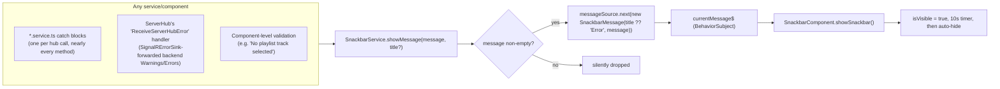

# Snackbar/toast notification system

_Category: [Frontend UI shell](../../DOCUMENTATION_CHECKLIST.md) · Last verified against code: 2026-09-25_

## What it does

A single shared toast (`SnackbarComponent`) shows the most recent error or status message from anywhere in the
app — every hub connection failure, every caught SignalR error, and every `SignalRErrorSink`-forwarded backend
Warning/Error (see [SignalRErrorSink](../05-realtime-sync/signalr-error-sink.md)) surfaces through this exact
same path.

## `SnackbarService`: a single-slot message stream

`SnackbarService` holds exactly one `BehaviorSubject<SnackbarMessage | null>` — there's no queue. `showMessage`
is called from nearly every catch block across every `*.service.ts` file (`LibraryService`, `PlayerService`,
`PlaylistService`, `ServerService`, `AutoScrollService`) and a handful of component-level validation checks
(`album-playlist.component.ts`'s "No playlist track selected", `album.component.ts`'s "No paths to play"). Each
service also has its own "error establishing connection with X hub" message for the initial SignalR connection
failure case, in addition to per-method call failures.

`SnackbarComponent` subscribes to `currentMessage$` once (`ngAfterViewInit`) and, on any new message, sets
`isVisible = true` and starts a fixed 10-second `timer()` that hides it again (`isVisible = false`,
`snackbar` reset to an empty `SnackbarMessage`). A new message arriving while one is already showing replaces
it immediately (the `BehaviorSubject` just emits the newer value) and effectively restarts the visible window,
since `showSnackbar` is called fresh each time.

## Where messages come from

- **Every SignalR hub call's catch block** — the overwhelming majority of call sites. Most pass
  `getErrorMessage(err)` (a shared helper that normalizes whatever shape an error arrives in) rather than the
  raw error object.
- **`ServerService`'s `"ReceiveServerHubError"` listener** — this is the client-side landing point for
  [`SignalRErrorSink`](../05-realtime-sync/signalr-error-sink.md)'s Warning-and-above backend log forwarding.
  Any backend `LogWarning`/`LogError` anywhere in the app ultimately surfaces here, through `ServerHub` (not the
  hub the failing operation happened to belong to) — the frontend always listens for this on the same
  connection regardless of which backend subsystem raised it.
- **Component-level validation** — a small number of client-side-only checks that never touch the network at
  all (e.g. a required selection missing before an action can proceed).

## Known constraints

- **Single-slot, no queue.** A message arriving while another is still visible replaces it outright — if two
  unrelated failures happen in quick succession, the user only ever sees the second one; the first is lost with
  no history or "1 of 2" indicator.
- **Fixed 10-second duration** for every message regardless of severity or length — there's no
  longer-for-errors/shorter-for-info distinction, and no manual dismiss button visible in the component's own
  logic (confirmed by the absence of any explicit dismiss handler beyond the timer).
- `showMessage` silently no-ops on an empty/falsy message — a caller passing an empty string produces no visible
  feedback at all, which could mask a genuine (if message-less) failure.
