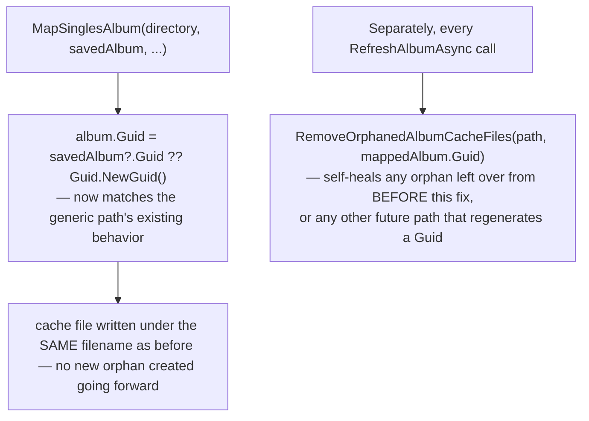

# Album cache file identity

_Category: [Persistence & storage architecture](../../DOCUMENTATION_CHECKLIST.md) · Last verified against code: 2026-09-25_ ·
_Fixed 2026-08-19, see `KNOWN_ISSUES.md` #25_

## The two identities an album has

Every album has two separate identifiers that mean different things and are used in different places — see
[Display metadata split](../02-library-mapping/display-metadata-split.md) for the full picture of why two
records exist at all:

- **`Album.Id`** (a Mongo `ObjectId`) — the Mongo document's own identity. Used for Mongo-side operations:
  `UpsertAlbumsAsync`'s `ReplaceOneModel` filter, `UpdateAlbumAsync`'s replace filter.
- **`Album.Guid`** (a `Guid`, `[BsonRepresentation(BsonType.String)]` — stored in Mongo but not used as the
  Mongo document key) — drives the **AppData JSON cache filename**: `{Guid}.json`. This is the identifier that
  matters for finding an album's display data on disk (`GetSelectedAlbumAsync`, the [cache-load
  pass](../02-library-mapping/cache-load-pass.md), `GetTrackEqualizerAssignmentsAsync`'s `ReadCachedAlbum`).

`Album.Guid` defaults to `Guid.NewGuid()` on every `new Album { ... }` construction. Nothing about creating a
fresh `Album` object automatically preserves a previous album's `Guid` — every mapping code path has to
*explicitly* carry it forward from the existing saved album (`savedAlbum?.Guid ?? Guid.NewGuid()`) for a refresh
to correctly overwrite the existing cache file rather than silently writing a new one under a new name.

## The bug: Singles refresh missing the carry-forward

`GetAlbums()`'s generic per-directory path and `RefreshMappedAlbum`'s generic branch both correctly carry
`Guid` forward (`album.Id = savedAlbum?.Id ?? ObjectId.GenerateNewId()` is paired with the equivalent `Guid`
assignment). `MapSinglesAlbum` — the dedicated path for the "Singles" pseudo-album (see [Full mapping
pipeline](../02-library-mapping/full-mapping-pipeline.md#the-singles-pseudo-album)) — originally did not. Every
refresh of the Singles folder generated a brand-new `Guid`, which meant:

1. The Mongo document updated correctly (matched by `Id`, which *was* carried forward).
2. But the AppData JSON cache write landed under a **new** filename (`{newGuid}.json`).
3. The **previous** cache file (`{oldGuid}.json`) was never cleaned up — single-album refreshes don't clear the
   whole cache directory the way a full rescan does.
4. The library grid, which enumerates every `*.json` file in the cache directory (the [cache-load
   pass](../02-library-mapping/cache-load-pass.md)), rendered both the old orphaned file and the new one as two
   separate cards — a duplicate "Singles" entry in the grid, growing by one more orphan on every subsequent
   refresh.

## The fix: carry `Guid` forward, plus self-healing cleanup

Two independent pieces, both in [Single-album refresh](../02-library-mapping/single-album-refresh.md): the
direct fix (`MapSinglesAlbum` now carries `Guid` forward, matching the generic path) stops new orphans from
being created; a separate self-healing cleanup (`RemoveOrphanedAlbumCacheFiles`, run on *every* successful
refresh, cheap enough to be unconditional) deletes any other cached file whose stored `Path` matches the
current album but whose filename doesn't match the just-written `Guid` — cleaning up orphans that were already
left behind by refreshes that ran before the fix shipped, without requiring the user to manually delete
anything.

## Known constraints

- `RemoveOrphanedAlbumCacheFiles` only runs from `RefreshAlbumAsync` — an orphan from any other future code path
  that might regenerate a `Guid` unexpectedly wouldn't be caught until that album happens to go through a
  single-album refresh again.
- The underlying fragility remains: any *new* mapping code path added later that constructs an `Album` object
  without explicitly carrying `Guid` forward would reintroduce the same bug class. There's no compile-time or
  test-level guard against this — it depends on whoever writes that new code path remembering the convention.
