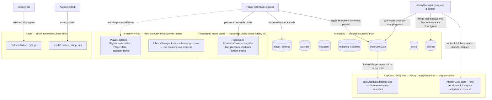

# Storage map — what lives where

_Category: [Persistence & storage architecture](../../DOCUMENTATION_CHECKLIST.md) · Last verified against code: 2026-08-19_

## Why this doc exists

Boombox spreads state across four genuinely different storage tiers — MongoDB, Redis, a per-user AppData JSON
file cache, and process-lifetime in-memory state — and no single place explained the full picture before this
doc. That gap has caused real bugs, not just confusion:

- **Item #18** (`KNOWN_ISSUES.md`): favourites/times-played were split across three independently-updated stores
  (Mongo `Album.Tracks[]`, the "Favourite" playlist, and the per-album JSON mirror) with no transaction tying
  them together — a partial write left them silently disagreeing.
- **Item #25**: the per-album JSON cache is keyed by `Album.Guid`, a field completely separate from Mongo's own
  `Id` — a code path that forgot to carry `Guid` forward produced a duplicate card in the library grid, because
  it silently wrote a second JSON file instead of overwriting the first.
- **Item #29**: two read paths served the per-album JSON cache straight off disk without ever refreshing it
  against live Mongo data, so a favourite toggled elsewhere showed correctly in the player but not in the
  album grid.

All three were instances of the same underlying shape: **the same piece of data mirrored in more than one
place, with no single obvious source of truth.** This doc exists so the next time that shape shows up, it's
recognizable immediately instead of requiring a fresh investigation.

## The four tiers, at a glance

## MongoDB — the durable source of truth

Seven collections (`MusicPlayer/Common/MongoDbClient.cs`, constructor). This is the only tier that's actually
durable and authoritative — everything else is either a display-performance cache, a small best-effort
convenience value, or gone on restart.

| Collection | Holds | Notes |
|---|---|---|
| `albums` | One document per mapped album directory — `Id`, `Guid`, `Path`, and album-level fields. | **`Track.Name`/`Artist`/`Duration`/`DiscNumber`/`TrackNumber`/`Image` are all `[BsonIgnore]`** — none of a track's actual display metadata is stored here. See "Why display metadata isn't in Mongo" below; this is the single most surprising fact about the whole storage model. |
| `playlists` | User-created playlists (name, ordered track paths) plus the built-in "Favourite" playlist. | The Favourite playlist is a real, playable playlist — see `features/03-playlists`. |
| `equalizer` | Named presets (Flat, Hip Hop, …) **and** per-track custom overrides, in the same collection. | A per-track override has `Name` set to the track's own file path and `IsDefault = false`; lookups match on `Name` either way — see `GetEqualizerPresetAsync`/`GetTrackEqualizerPresetGuidAsync`'s replacement, `BuildEqualizerPresetLookup`. |
| `mapping_statistics` | One document per completed mapping run (Cache or FullScan), feeding Settings → Mapping Statistics. | Written at the end of a run via the `MappingUpdate.Changed` event bridge; see `features/05-realtime-sync`. |
| `player_settings` | A single document: last-used `AudioOutput` (Speakers/Headset) and playback `Mode`. | The *only* piece of `Player`'s state that survives a `MusicServer` restart — everything else in `Player`/`PlaybackInformation` is rebuilt from scratch. |
| `lyrics` | One document per track path — parsed `LyricsLine[]`, `LyricsSource`, or a cached "nothing found" sentinel. | Lazy: only ever written the first time a track's lyrics dialog is opened. See `features/04-lyrics`. |
| `trackUserData` | One document per track path — `IsFavourite`, `TimesPlayed`, `UpdatedAtUtc`. | **Single source of truth for favourites/play counts as of item #18** (2026-08-18) — replaced a three-way split across `albums.Tracks[].IsFavourite`, the Favourite playlist, and the per-album JSON mirror. Case-insensitive collation, since Windows paths are case-insensitive but case-preserving. |

## Redis — small, ephemeral, best-effort

Only two keys are ever actually written anywhere in the app (confirmed by grepping every `RedisCache.SetAsync`
call site):

- **`SelectedAlbum`** (`LibraryHub.UpdateSelectedAlbumAsync`) — the path of whichever album's detail page is
  currently open, so `GetSelectedAlbumAsync` can re-resolve it without the frontend having to pass it on every
  call.
- **`scrollProsition`** (`AutoScrollHub`, misspelling is in the actual key name) — the library grid's scroll
  offset, so it survives a page refresh/reconnect. See `features/06-frontend-ui` for why this is server-side
  rather than the more obvious client-side `localStorage`.

**A third key, `"Playlists"`, was designed for but never implemented** — `PlaylistBroadcast`/`PlaylistHub` both
had code paths that *read* a `"Playlists"` Redis key to merge-cache playlist data, but nothing ever *wrote* it.
Since `RedisCache.GetAsync` throws by design on a missing key, this wasn't an intermittent failure, it was
permanently, structurally dead code — removed entirely rather than fixed (`KNOWN_ISSUES.md` #2/#3). Worth
knowing if you ever see `"Playlists"` mentioned in old comments or commit history: it never actually existed
at runtime.

## AppData JSON files — `%AppData%/Boombox` — the display cache

`MusicPlayer/FileManagement/FileManager.cs` owns this directory. Two things are actually written here in
practice:

- **`{Album.Guid}.json`** — one file per mapped album, written via the generic `FileManager.Write<T>(T
  content) where T : IFileWritable`. This is the **only** place a track's actual display metadata
  (name/artist/track#/duration/cover image) lives — Mongo's `albums` collection deliberately excludes all of
  it via `[BsonIgnore]`. The library grid and album detail page both read straight from these files rather than
  from Mongo, which is why a stale JSON file (item #25's orphaned duplicate, item #29's unrefreshed favourite
  state) shows up as a real, user-visible bug rather than a harmless inconsistency.

  **The filename is keyed by `Album.Guid`, not Mongo's `Id`.** These are two separate fields on the same
  `Album` document — `Guid` exists *specifically* to name this file, and defaults to a fresh random value on
  every `new Album { ... }`. Every code path that maps or refreshes an album must explicitly carry the
  *existing* album's `Guid` forward, or the next write silently creates an orphaned second file instead of
  overwriting the first. This is exactly what happened in item #25 (`MapSinglesAlbum` was missing the
  carry-forward line that every other mapping branch already had).

- **`trackUserData.backup.json`** — a disaster-recovery snapshot of the *entire* `trackUserData` Mongo
  collection, overwritten wholesale on every real favourite/play-count write (`MongoDbClient.
  BackupTrackUserDataAsync`, fire-and-forget). Deliberately **write-only during normal operation** — it's read
  exactly once, at startup, and only as a migration source if the Mongo collection is found empty. This is a
  conscious choice: having a second *actively read* copy of the same data is the exact shape of bug item #18
  fixed, so this file stays a dormant backup, never a live second source of truth.

**Two more types implement the same `IFileWritable` interface but are effectively dead:**

- `EqualizerPreset : IFileWritable` has a working `GetFileContent()`, but nothing in the codebase ever actually
  calls `FileManager.Instance.Write(preset)` — equalizer presets are persisted to Mongo only. If you're reading
  the interface and assuming presets have a JSON mirror the way albums do, they don't.
- `LibraryManagement/Models/UserData.cs` (`FavouriteTrackPaths: List<string>`) is unreferenced anywhere else in
  the codebase — a pre-trackUserData-consolidation leftover, never constructed or written. Safe to ignore or
  remove; documented here so it isn't mistaken for a live mechanism.

## Resampled audio cache — a fourth on-disk tier, *not* AppData

`Constants.RESAMPLED_PROVIDERS_DIRECTORY` lives **inside the Music library folder itself**
(`{LIBRARY_DIRECTORY}\Resampled Providers`), not under AppData — a deliberate-looking but easy-to-miss
distinction. It holds the `.wav` cache files the playback engine resamples tracks into before they're playable
(see `features/01-playback-engine`'s lazy resample window doc). Two consequences worth knowing:

- The library `FileSystemWatcher` (`FileManager`'s constructor) watches the whole `LIBRARY_DIRECTORY` tree for
  new/deleted album folders, so `OnCreated`/`OnDeleted` explicitly skip this directory — otherwise every
  resample would look like a new "album" being added.
- It's genuinely ephemeral and session-scoped: as of the lazy resample window (item #26), only the current
  track's small lookahead/retention window is ever resampled at once, cleaned up as playback moves on, and the
  whole directory is cleared on every `MusicServer` startup regardless.

## In-memory only — gone on every `MusicServer` restart

Two singletons hold meaningful state that's never persisted anywhere:

- **`Player.Instance`** — `PlaybackInformation`/`PlayerState` (is-playing, current position, shuffle/repeat
  mode, HasNext/HasPrevious, audio output availability) and `_queuedPlaylist` (the live now-playing queue).
  None of this survives a restart; only the *last-used output and mode* are persisted, to `player_settings`
  (see above) — the actual queue and playback position are not, by design.
- **`LibraryManager.Instance.MappingUpdate`** — live progress for whichever mapping run (Cache or FullScan) is
  currently in flight, including the once-a-second CPU/memory samples the Settings page's live view reads.
  Only the *completed* summary of a run gets written to `mapping_statistics`; the live tick-by-tick state
  itself is never persisted.

## Frontend — no active client-side storage

The Angular app has a `LocalStorageService` wrapping `localStorage`, but grepping every call site turns up
none — it's unreferenced outside its own file and spec test, effectively dead code. In practice **the frontend
holds no persistent state of its own at all**: everything either comes fresh from a SignalR push/hub call on
load, or — for the two things you'd normally expect to be `localStorage` candidates, selected album and scroll
position — is deliberately server-side via Redis instead (see above). Worth knowing if a future feature needs
"remember this across a refresh": the established pattern in this app is a small Redis key plus a hub method,
not browser storage.

## Quick reference: "where does X live?"

| Question | Answer |
|---|---|
| Is this track favourited? | `trackUserData` (Mongo) is authoritative. Two read paths (`GetSelectedAlbumAsync`, the library grid's fast cache load) overlay it live onto the JSON cache at read time — see `LibraryManager.ApplyLiveTrackUserDataAsync`, item #29. |
| What's this track's name/artist/duration? | The per-album `{Guid}.json` file only — never Mongo. |
| What equalizer preset is assigned to this track? | `equalizer` collection, matched by `Name == track path`. |
| What's currently playing / queue position? | In-memory only, inside `Player.Instance` — ask the running process, not any store. |
| What output device was last used? | `player_settings` (Mongo) — the one piece of `Player` state that does persist. |
| Which album's detail page is open? | `SelectedAlbum` (Redis). |
