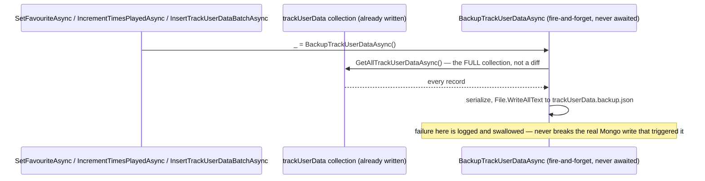
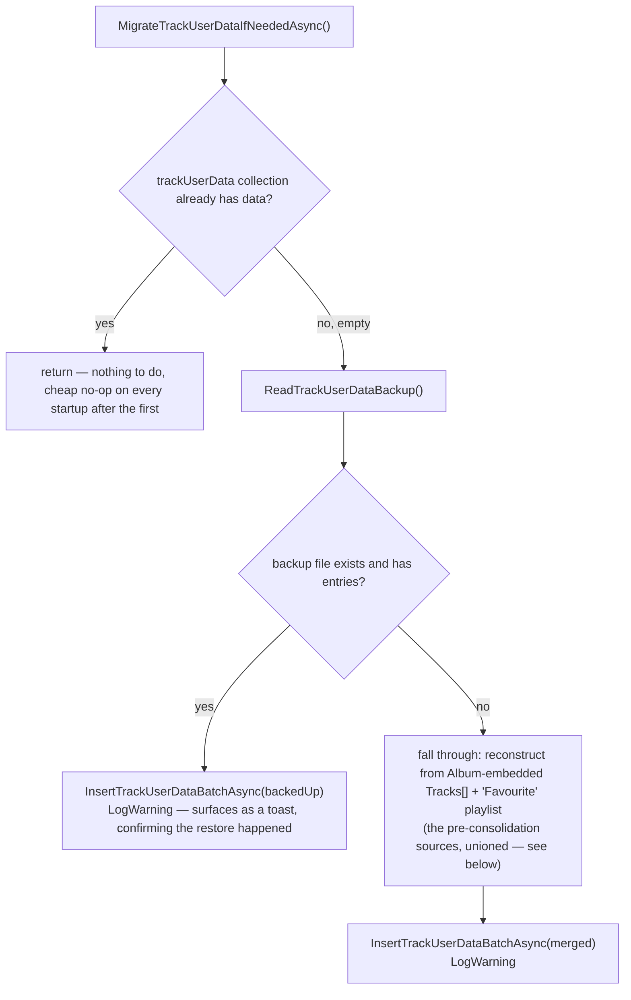

# trackUserData disaster-recovery backup

_Category: [Persistence & storage architecture](../../DOCUMENTATION_CHECKLIST.md) · Last verified against code: 2026-09-25_ ·
_Implemented 2026-08-19_

## What it does

`%AppData%\Boombox\trackUserData.backup.json` (via `FileManager`, alongside the per-album JSON cache — see
[Storage map](storage-map.md)) is a full snapshot of the entire `trackUserData` collection, rewritten on every
single real write to that collection. It exists purely to survive a full MongoDB data clear.

## Why it's needed: `trackUserData` is now the ONLY store

Before [track user data consolidation](track-user-data-consolidation.md), favourite/times-played state was
duplicated across three places (embedded in `Album` documents, the "Favourite" playlist, and the AppData JSON
cache) — a design with real correctness problems, but an accidental side benefit: no single data loss event
could wipe *all* of it at once. Consolidating onto one collection fixed the correctness problem but introduced a
new single point of failure — a full Mongo clear (deliberate or accidental) now had nothing left to reconstruct
from. This backup file is the direct fix for that gap.

## Write path: fire-and-forget, full snapshot, every time

Every write path in [Track user data](../02-library-mapping/track-user-data.md) — `SetFavouriteAsync`,
`IncrementTimesPlayedAsync`, and `InsertTrackUserDataBatchAsync` (the migration's own bulk insert) — calls
`BackupTrackUserDataAsync()` afterward, fire-and-forget (`_ = BackupTrackUserDataAsync()`, never `await`ed).
The method re-reads and rewrites the **entire** collection on every call, rather than computing or appending an
incremental diff. At this app's real scale (a personal library, roughly 6,400 tracks as of the last migration),
a full collection scan plus a full file rewrite per toggle/play is trivially cheap — and doing a full rewrite
guarantees correctness with zero cache-sync risk between an incremental diff and what's actually in Mongo,
which matters more here than shaving a few milliseconds off a background write. Any failure (disk full,
permissions) is caught, logged, and swallowed — this is a safety net, not something playback correctness
depends on, so a backup-write problem must never be allowed to break the real Mongo write that triggered it.

`InsertTrackUserDataBatchAsync` (the migration path) seeds the backup file immediately after a fresh migration
completes, rather than waiting for the first subsequent real toggle/play — closing a narrow gap where a second
Mongo clear landing right after a migration (before any real user write happened yet) would otherwise have
nothing to recover from.

## Read path: consulted exactly once, and only under one condition

`LibraryManager.MigrateTrackUserDataIfNeededAsync()` — run once, awaited, from `MusicServer`'s startup sequence,
before anything else can read `trackUserData` — is the **only** consumer of this file, and only when it finds
`trackUserData` empty:

The backup file is preferred over reconstructing from Mongo's `albums`/`playlists` collections specifically
because a full Mongo clear wipes those too — they can't help recover from exactly the scenario this backup
exists for. The backup is also strictly fresher and more complete: it's rewritten on every real
favourite/times-played change, while `albums`/`playlists` only ever reflect whatever was true at each album's
*last mapping run* — meaning a favourite toggled since the last mapping wouldn't be captured by that fallback
path at all.

**Original-sources fallback**, only reached if no backup file exists yet (a genuinely first-ever run, before
this collection or its backup ever existed): unions `Album.Tracks[]`'s embedded `TimesPlayed`/`IsFavourite`
with the "Favourite" playlist's track list, taking the *maximum* `TimesPlayed` (not overwriting) for a path that
somehow appears in more than one saved `Album` snapshot (e.g. a stale duplicate from a moved directory) — the
safer direction to err in for a one-time migration — and separately covering any Favourite-playlist track that
isn't attached to a currently-mapped album at all (rare, e.g. the album was since moved or deleted, but a real
case the per-album loop alone would miss).

Both the backup-restore and the fallback-reconstruction paths log at `LogWarning`, deliberately — this is the
one and only time this migration ever runs, and (via [SignalRErrorSink](../05-realtime-sync/signalr-error-sink.md))
surfacing it as a client-facing toast is a useful, reassuring confirmation that it actually happened, the same
reasoning `AudioOutputAvailabilityBroadcast`'s forced-fallback notification uses the mechanism for.

## Known constraints

- The backup file itself has no backup of its own, and is local to the machine running `MusicServer` — it
  protects against a Mongo-side data loss, not a filesystem-side one on the same host.
- Deliberately never read during normal operation — only `MigrateTrackUserDataIfNeededAsync`'s empty-collection
  check ever opens it, so a corrupted backup file would only be discovered at the least convenient moment (mid
  disaster-recovery), not proactively.
