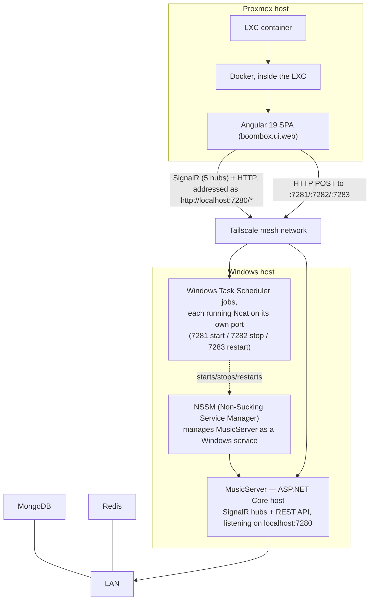

# Full deployment topology

_Category: [Deployment & infrastructure](../../DOCUMENTATION_CHECKLIST.md) · Last verified: 2026-09-25_

## Why this doc exists separately from the code

None of this is derivable from either repo — both `boombox.services.musicplayer` and `boombox.ui.web` are
written as if they'll simply be run somewhere, with no Dockerfile, NSSM config, or infrastructure-as-code
checked into either repo. This doc records the topology as confirmed by the person running it, so a future
maintainer (including a future instance of whoever's helping with this repo) doesn't have to ask again.

## The topology

- **`MusicServer`** (the ASP.NET Core host — SignalR hubs plus the `/api/status` REST endpoint) runs directly on
  the user's Windows machine, managed as a Windows service by **NSSM**. This is why the Angular frontend's
  environment files address it as `http://localhost:7280` — that's `localhost` *from the Windows host's own
  perspective*, which is where the actual TCP connection terminates once Tailscale has routed it there; the
  Angular app itself is not running on that machine.
- **The Angular UI** runs inside **Docker, inside an LXC container, on Proxmox** — separate virtualized
  infrastructure from the Windows machine running `MusicServer`.
- **MongoDB and Redis** run on the LAN (see [Storage map](../07-persistence-storage/storage-map.md) for what
  each actually stores) — reachable by `MusicServer` directly, not routed through Tailscale the way the
  browser-to-`MusicServer` traffic is.
- **Tailscale** bridges the Proxmox-hosted UI to the Windows-hosted backend. Every SignalR hub connection (see
  [Hub topology](../05-realtime-sync/hub-topology.md)) and the three remote-control ports (see [Remote
  start/stop/restart mechanism](remote-control-mechanism.md)) cross this bridge.

## Why `localhost` appears in the frontend's environment config

`boombox.ui.web/src/environments/environment.ts` hardcodes every hub URL and remote-control URL against
`http://localhost:<port>` — this only works because Tailscale makes the Windows host's `localhost` reachable as
if it were local from the Proxmox-hosted container's perspective (via Tailscale's own IP routing, not literal
`localhost` resolution across machines — the practical effect from the frontend's point of view is the same).
This is a real, working, but slightly fragile arrangement: it depends on the Tailscale connection being up and
correctly routed, and on nothing else on either machine claiming those same ports.

## Known constraints

- None of this deployment configuration lives in either repo — it exists only in Windows service configuration,
  Proxmox/Docker/LXC configuration, Windows Task Scheduler, and Tailscale's own network configuration, all
  external to what's checked in here. A fresh clone of either repo alone is not enough to stand this up; the
  infrastructure has to be recreated by hand following this doc.
- `MusicServer/Program.cs`'s CORS policy currently allows only `http://localhost:9878` — flagged separately
  (not by this doc) as possibly stale or incorrect for the actual Tailscale-bridged topology described here;
  changing it needs confirmation of current intent before assuming the existing value is correct.
