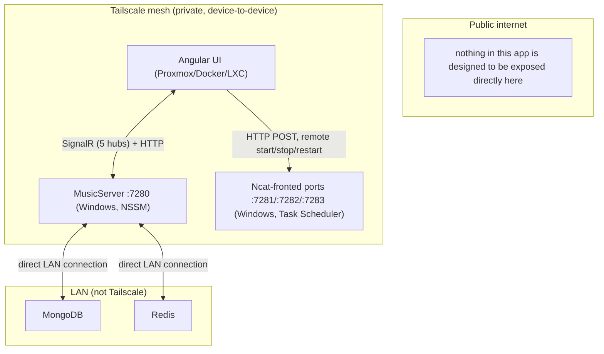

# Network / firewall assumptions

_Category: [Deployment & infrastructure](../../DOCUMENTATION_CHECKLIST.md) · Last verified: 2026-09-25_

## What needs to reach what

See [Full deployment topology](deployment-topology.md) for the complete picture; this doc focuses specifically
on which traffic crosses which network boundary.

- **Browser (or the Angular container) ↔ `MusicServer`**: every SignalR hub connection (see [Hub
  topology](../05-realtime-sync/hub-topology.md)) and the Homepage dashboard's `/api/status` REST call (see
  `KNOWN_ISSUES.md` #31) cross the Tailscale mesh, terminating at the Windows host's `localhost:7280`.
- **Browser (or the Angular container) ↔ the three Ncat ports**: also over Tailscale — see [Remote
  start/stop/restart mechanism](remote-control-mechanism.md).
- **`MusicServer` ↔ MongoDB/Redis**: direct LAN connections, not routed through Tailscale — these run on
  separate LAN infrastructure the Windows host can reach directly, per [Full deployment
  topology](deployment-topology.md).
- **Nothing in this app is designed to be exposed to the public internet directly.** Tailscale's own
  device-level access control is the entire access boundary between "can reach `MusicServer`/the Ncat ports at
  all" and "cannot" — there is no separate application-level authentication layer on top of it anywhere in
  either repo.

## CORS: a possibly-stale policy

`MusicServer/Program.cs` configures a single CORS policy allowing only `http://localhost:9878`
(`AllowAnyMethod().AllowAnyHeader().AllowCredentials().WithOrigins("http://localhost:9878")`) — a port that
doesn't match any of the URLs the Angular frontend's `environment.ts` actually uses (`:7280`–`:7283`). This
policy predates, or was never updated alongside, the current Tailscale-bridged topology, and was flagged during
an earlier review as possibly stale or simply wrong for how the app is actually reached today — not confirmed
correct, and not something to change without checking current intent first, since SignalR/browser CORS
behavior and Tailscale-routed traffic can interact in ways worth confirming deliberately rather than assuming.

## Known constraints

- No firewall/network configuration is checked into either repo (matching [Full deployment
  topology](deployment-topology.md)'s note that none of the infrastructure is code-defined) — Windows Firewall
  rules, Proxmox network configuration, and Tailscale ACLs all live outside source control entirely.
- The CORS policy's mismatch with the app's real origins means it's either dead configuration (never actually
  enforced against real traffic, if SignalR/Tailscale routing bypasses it in practice) or a genuine
  misconfiguration that happens not to have caused a visible problem yet — this doc doesn't resolve which, only
  flags it as unresolved.
