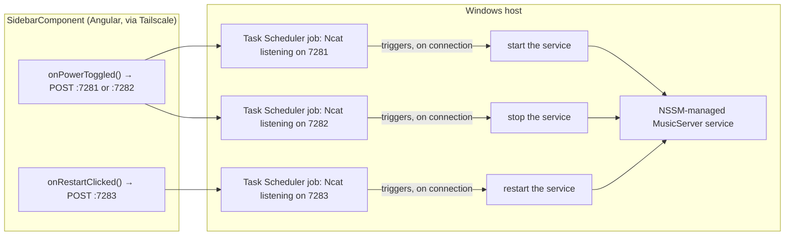

# Remote start/stop/restart mechanism

_Category: [Deployment & infrastructure](../../DOCUMENTATION_CHECKLIST.md) · Last verified: 2026-09-25_

## What it does

The sidebar's power and restart controls (see [Sidebar navigation](../06-frontend-ui-shell/sidebar-navigation.md#server-powerrestart-plain-http-not-signalr))
let the user start, stop, or restart the `MusicServer` Windows service remotely — without SSH or RDP access to
the Windows machine, and without any code in either repo implementing the actual start/stop/restart logic.

## No corresponding backend code — by design

`boombox.ui.web/src/environments/environment.ts` defines three URLs:

```
startServerUrl:   http://localhost:7281/
stopServerUrl:    http://localhost:7282/
restartServerUrl: http://localhost:7283/
```

Grepping either repo for a server listening on 7281/7282/7283, or any controller/handler that would respond to
a plain `HttpClient.post(...)` against them, finds nothing — because there isn't any. These three ports are not
part of `MusicServer` or any other code in this codebase.

## What's actually listening: Ncat behind Windows Task Scheduler



Each port is fronted by **Ncat** (the Nmap project's netcat variant), itself launched and triggered via
**Windows Task Scheduler** jobs configured directly on the Windows host — entirely outside both repos. A
connection landing on one of these ports (the Angular app's plain HTTP `POST` is enough to trigger this — no
particular payload or method matters, the connection itself is the trigger) fires the associated Scheduled Task,
which in turn starts, stops, or restarts the NSSM-managed `MusicServer` service.

This explains why `SidebarComponent`'s power/restart handlers use plain `HttpClient.post` rather than a SignalR
hub call the way virtually everything else in the app does (see [Hub topology](../05-realtime-sync/hub-topology.md))
— a stopped `MusicServer` has no SignalR hub to call in the first place; the remote-control mechanism has to
exist entirely independent of the service it's controlling.

## The 3-second reconnect delay

After a successful start action, `SidebarComponent` waits a fixed 3 seconds before calling
`serverService.startConnectionAsync()` to re-establish the SignalR connection — a guess at how long the
NSSM-managed service needs to come up, not a readiness poll. See [Sidebar
navigation](../06-frontend-ui-shell/sidebar-navigation.md) for the frontend-side detail.

## Known constraints

- No authentication on the Ncat-fronted ports beyond whatever Tailscale's own network-level access control
  provides — anyone who can reach the Tailscale network and knows the three ports can trigger a start/stop/
  restart. Acceptable for a personal, single-user deployment; would need hardening for anything broader.
- Entirely undocumented in either repo's own configuration — this doc, plus the Windows Task Scheduler jobs and
  Ncat command lines themselves (external to source control), are the only record of exactly how each job is
  configured. A fresh setup requires recreating these Scheduled Tasks by hand.
- No feedback loop confirming the action actually succeeded — the frontend fires the request and assumes it
  worked (aside from the fixed reconnect delay for the start case); a failed Ncat trigger or Task Scheduler job
  wouldn't be visibly reported back to the user beyond the eventual SignalR reconnect timing out.
